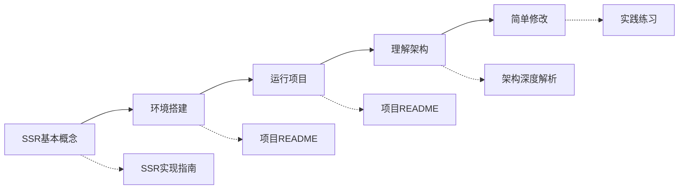
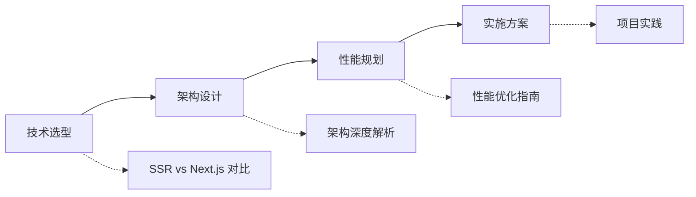
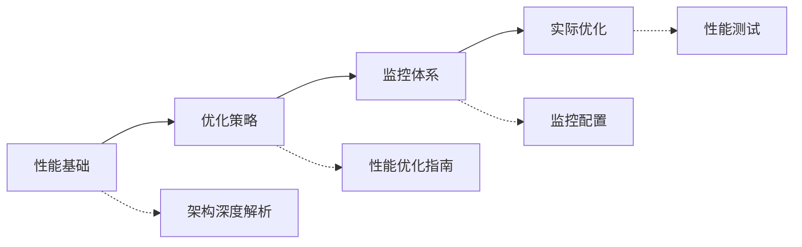

# 文档索引

## 📋 快速索引

### 按主题分类

#### 🏗️ 架构设计
| 文档 | 描述 | 难度 | 预计阅读时间 |
|------|------|------|-------------|
| [SSR架构深度解析](./SSR_ARCHITECTURE_DEEP_DIVE.md) | 深入分析SSR架构设计和实现原理 | ⭐⭐⭐⭐ | 30分钟 |
| [SSR实现指南](./SSR_IMPLEMENTATION_GUIDE.md) | SSR基本概念和实现步骤 | ⭐⭐⭐ | 20分钟 |

#### ⚖️ 技术选型
| 文档 | 描述 | 难度 | 预计阅读时间 |
|------|------|------|-------------|
| [SSR vs Next.js 对比](./SSR_VS_NEXTJS_COMPARISON.md) | 自定义SSR与Next.js的全面对比 | ⭐⭐⭐ | 25分钟 |

#### ⚡ 性能优化
| 文档 | 描述 | 难度 | 预计阅读时间 |
|------|------|------|-------------|
| [SSR性能优化指南](./SSR_PERFORMANCE_OPTIMIZATION.md) | 全面的性能优化策略和实践 | ⭐⭐⭐⭐⭐ | 45分钟 |

### 按角色分类

#### 👨‍💻 开发者
- **新手开发者**: [SSR实现指南](./SSR_IMPLEMENTATION_GUIDE.md) → [项目README](../README.md)
- **中级开发者**: [SSR架构深度解析](./SSR_ARCHITECTURE_DEEP_DIVE.md) → [性能优化指南](./SSR_PERFORMANCE_OPTIMIZATION.md)
- **高级开发者**: [性能优化指南](./SSR_PERFORMANCE_OPTIMIZATION.md) → [架构深度解析](./SSR_ARCHITECTURE_DEEP_DIVE.md)

#### 🏗️ 架构师
- **技术选型**: [SSR vs Next.js 对比](./SSR_VS_NEXTJS_COMPARISON.md)
- **架构设计**: [SSR架构深度解析](./SSR_ARCHITECTURE_DEEP_DIVE.md)
- **性能规划**: [SSR性能优化指南](./SSR_PERFORMANCE_OPTIMIZATION.md)

#### 📊 产品经理
- **技术理解**: [SSR实现指南](./SSR_IMPLEMENTATION_GUIDE.md) (概念部分)
- **技术选择**: [SSR vs Next.js 对比](./SSR_VS_NEXTJS_COMPARISON.md) (选择指南部分)

### 按使用场景分类

#### 🚀 项目启动
1. [SSR实现指南](./SSR_IMPLEMENTATION_GUIDE.md) - 了解基本概念
2. [项目README](../README.md) - 环境搭建
3. [SSR架构深度解析](./SSR_ARCHITECTURE_DEEP_DIVE.md) - 理解架构

#### 🔧 技术选型
1. [SSR vs Next.js 对比](./SSR_VS_NEXTJS_COMPARISON.md) - 对比分析
2. [SSR架构深度解析](./SSR_ARCHITECTURE_DEEP_DIVE.md) - 技术深度
3. [SSR性能优化指南](./SSR_PERFORMANCE_OPTIMIZATION.md) - 性能考量

#### 📈 性能优化
1. [SSR性能优化指南](./SSR_PERFORMANCE_OPTIMIZATION.md) - 优化策略
2. [SSR架构深度解析](./SSR_ARCHITECTURE_DEEP_DIVE.md) - 架构优化
3. [SSR实现指南](./SSR_IMPLEMENTATION_GUIDE.md) - 基础优化

#### 🐛 问题排查
1. [SSR实现指南](./SSR_IMPLEMENTATION_GUIDE.md) - 常见问题
2. [SSR架构深度解析](./SSR_ARCHITECTURE_DEEP_DIVE.md) - 错误处理
3. [SSR性能优化指南](./SSR_PERFORMANCE_OPTIMIZATION.md) - 性能问题

## 🔍 关键词索引

### A-C
- **API代理**: [架构深度解析](./SSR_ARCHITECTURE_DEEP_DIVE.md#api代理层)
- **缓存策略**: [性能优化指南](./SSR_PERFORMANCE_OPTIMIZATION.md#多层缓存策略)
- **代码分割**: [性能优化指南](./SSR_PERFORMANCE_OPTIMIZATION.md#代码分割策略)

### D-H
- **Docker部署**: [SSR vs Next.js 对比](./SSR_VS_NEXTJS_COMPARISON.md#部署和运维)
- **错误处理**: [架构深度解析](./SSR_ARCHITECTURE_DEEP_DIVE.md#错误处理和监控)
- **服务端渲染**: [SSR实现指南](./SSR_IMPLEMENTATION_GUIDE.md#什么是ssr)
- **HTTP/2**: [性能优化指南](./SSR_PERFORMANCE_OPTIMIZATION.md#http2-和压缩)

### I-N
- **监控指标**: [性能优化指南](./SSR_PERFORMANCE_OPTIMIZATION.md#核心指标监控)
- **流式渲染**: [架构深度解析](./SSR_ARCHITECTURE_DEEP_DIVE.md#流式渲染)
- **Next.js对比**: [SSR vs Next.js 对比](./SSR_VS_NEXTJS_COMPARISON.md)

### O-S
- **性能预算**: [性能优化指南](./SSR_PERFORMANCE_OPTIMIZATION.md#性能预算)
- **水合优化**: [性能优化指南](./SSR_PERFORMANCE_OPTIMIZATION.md#水合优化)
- **SSR架构**: [架构深度解析](./SSR_ARCHITECTURE_DEEP_DIVE.md#整体架构图)

### T-Z
- **TypeScript**: [SSR实现指南](./SSR_IMPLEMENTATION_GUIDE.md#typescript支持)
- **Vite配置**: [SSR实现指南](./SSR_IMPLEMENTATION_GUIDE.md#构建配置)
- **Web Vitals**: [性能优化指南](./SSR_PERFORMANCE_OPTIMIZATION.md#核心指标监控)
- **状态管理**: [架构深度解析](./SSR_ARCHITECTURE_DEEP_DIVE.md#状态管理集成)

## 📊 文档统计

### 文档概览
| 文档 | 字数 | 代码示例 | 图表 | 最后更新 |
|------|------|----------|-------|----------|
| SSR实现指南 | ~8,000 | 15+ | 3 | 2024-01 |
| SSR vs Next.js 对比 | ~12,000 | 20+ | 5 | 2024-01 |
| SSR架构深度解析 | ~15,000 | 25+ | 4 | 2024-01 |
| SSR性能优化指南 | ~18,000 | 30+ | 6 | 2024-01 |

### 技术覆盖度
- **前端技术**: React, TypeScript, Vite, Tailwind CSS
- **后端技术**: Node.js, Express, Redis, 缓存策略
- **性能优化**: Web Vitals, 代码分割, 懒加载, 缓存
- **部署运维**: Docker, Nginx, 监控, 告警

## 🎯 学习路径推荐

### 🔰 初学者路径 (预计学习时间: 2-3天)

### 🏗️ 架构师路径 (预计学习时间: 1-2天)

### ⚡ 性能工程师路径 (预计学习时间: 2-3天)

## 📚 扩展阅读

### 官方文档
- [React 18 SSR](https://reactjs.org/blog/2022/03/29/react-v18.html#new-suspense-features)
- [Express.js 最佳实践](https://expressjs.com/en/advanced/best-practice-performance.html)
- [Web Performance](https://web.dev/performance/)

### 社区资源
- [SSR vs CSR vs SSG](https://web.dev/rendering-on-the-web/)
- [React Performance](https://kentcdodds.com/blog/fix-the-slow-render-before-you-fix-the-re-render)
- [Node.js Performance](https://nodejs.org/en/docs/guides/simple-profiling/)

### 工具和库
- [React DevTools Profiler](https://reactjs.org/blog/2018/09/10/introducing-the-react-profiler.html)
- [Lighthouse CI](https://github.com/GoogleChrome/lighthouse-ci)
- [Bundle Analyzer](https://github.com/webpack-contrib/webpack-bundle-analyzer)

## 🔄 文档更新计划

### 近期更新 (1-2周)
- [ ] 添加更多实际案例
- [ ] 完善错误处理示例
- [ ] 增加性能测试脚本

### 中期更新 (1个月)
- [ ] 添加视频教程链接
- [ ] 创建交互式示例
- [ ] 增加FAQ部分

### 长期更新 (3个月)
- [ ] 多语言版本支持
- [ ] 社区贡献指南
- [ ] 高级主题深入

---

*文档索引最后更新: 2024年1月*
