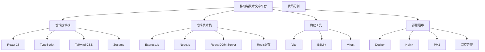

# 移动端技术文章阅读平台 - 文档中心

## 📚 文档概览

本文档中心包含了移动端技术文章阅读平台的完整技术文档，涵盖SSR实现、架构设计、性能优化和最佳实践等内容。

## 📖 文档目录

### 1. [SSR实现指南](./SSR_IMPLEMENTATION_GUIDE.md)
- **内容**: SSR的基本概念、实现步骤和核心代码
- **适合**: 初学者和希望了解SSR实现细节的开发者
- **重点**: 
  - SSR vs CSR 对比
  - 实现步骤详解
  - 核心代码示例
  - 常见问题解决

### 2. [SSR vs Next.js 全面对比](./SSR_VS_NEXTJS_COMPARISON.md)
- **内容**: 自定义SSR与Next.js框架的详细对比分析
- **适合**: 技术选型决策者和架构师
- **重点**:
  - 架构对比分析
  - 开发体验对比
  - 性能表现对比
  - 选择决策矩阵

### 3. [SSR架构深度解析](./SSR_ARCHITECTURE_DEEP_DIVE.md)
- **内容**: 深入分析SSR架构设计和实现原理
- **适合**: 高级开发者和系统架构师
- **重点**:
  - 整体架构设计
  - 核心组件详解
  - 数据流分析
  - 错误处理机制

### 4. [SSR性能优化指南](./SSR_PERFORMANCE_OPTIMIZATION.md)
- **内容**: 全面的SSR性能优化策略和实践
- **适合**: 性能工程师和高级开发者
- **重点**:
  - 多层缓存策略
  - 渲染性能优化
  - 客户端优化
  - 性能监控体系

## 🎯 快速导航

### 按角色分类

#### 🔰 初学者
1. 先阅读 [SSR实现指南](./SSR_IMPLEMENTATION_GUIDE.md) 了解基础概念
2. 参考项目根目录的 [README.md](../README.md) 进行环境搭建
3. 查看 [SSR vs Next.js 对比](./SSR_VS_NEXTJS_COMPARISON.md) 理解技术选择

#### 🏗️ 架构师/技术负责人
1. 重点阅读 [SSR vs Next.js 对比](./SSR_VS_NEXTJS_COMPARISON.md) 进行技术选型
2. 深入研究 [SSR架构深度解析](./SSR_ARCHITECTURE_DEEP_DIVE.md) 了解系统设计
3. 参考 [性能优化指南](./SSR_PERFORMANCE_OPTIMIZATION.md) 制定性能策略

#### ⚡ 性能工程师
1. 直接查看 [SSR性能优化指南](./SSR_PERFORMANCE_OPTIMIZATION.md)
2. 结合 [架构深度解析](./SSR_ARCHITECTURE_DEEP_DIVE.md) 理解优化点
3. 参考性能监控和指标定义

### 按场景分类

#### 🚀 项目启动
- [SSR实现指南](./SSR_IMPLEMENTATION_GUIDE.md) - 了解实现方式
- [项目README](../README.md) - 环境搭建和运行

#### 🔧 技术选型
- [SSR vs Next.js 对比](./SSR_VS_NEXTJS_COMPARISON.md) - 全面对比分析
- [架构深度解析](./SSR_ARCHITECTURE_DEEP_DIVE.md) - 技术深度

#### 📈 性能优化
- [性能优化指南](./SSR_PERFORMANCE_OPTIMIZATION.md) - 优化策略
- [架构深度解析](./SSR_ARCHITECTURE_DEEP_DIVE.md) - 架构优化

#### 🐛 问题排查
- [SSR实现指南](./SSR_IMPLEMENTATION_GUIDE.md) - 常见问题
- [架构深度解析](./SSR_ARCHITECTURE_DEEP_DIVE.md) - 错误处理

## 🔍 核心概念速查

### SSR关键术语
- **服务端渲染 (SSR)**: 在服务器上渲染React组件为HTML字符串
- **客户端水合 (Hydration)**: 在客户端为服务端渲染的HTML添加交互性
- **同构应用 (Isomorphic)**: 同一套代码可以在服务端和客户端运行
- **流式渲染 (Streaming)**: 边渲染边输出HTML，提升首屏速度

### 架构组件
- **Express服务器**: HTTP请求处理和路由分发
- **API代理层**: 数据获取和格式转换
- **渲染引擎**: React组件服务端渲染
- **缓存系统**: 多层缓存提升性能

### 性能指标
- **LCP (Largest Contentful Paint)**: 最大内容绘制时间
- **FID (First Input Delay)**: 首次输入延迟
- **CLS (Cumulative Layout Shift)**: 累积布局偏移
- **TTFB (Time to First Byte)**: 首字节时间

## 📊 技术栈概览



## 🛠️ 开发工作流

### 1. 开发环境
```bash
# 客户端开发
pnpm dev

# SSR开发
pnpm dev:ssr

# 测试
pnpm test
```

### 2. 构建部署
```bash
# 构建SSR
pnpm build:ssr

# 生产预览
pnpm preview:ssr
```

### 3. 性能监控
- 使用 Web Vitals 监控核心指标
- 实时性能告警
- 性能预算管理

## 📈 项目指标

### 性能目标
- **首屏渲染**: < 2.5秒
- **交互延迟**: < 100毫秒
- **布局稳定性**: CLS < 0.1
- **水合时间**: < 1秒

### 代码质量
- **TypeScript覆盖率**: 100%
- **测试覆盖率**: > 80%
- **ESLint规则**: 严格模式
- **性能预算**: 250KB初始包

## 🤝 贡献指南

### 文档贡献
1. 发现文档问题或改进建议
2. 创建Issue描述问题
3. 提交PR修复或改进
4. 代码审查和合并

### 代码贡献
1. 遵循项目代码规范
2. 添加相应的测试用例
3. 更新相关文档
4. 确保性能指标达标

## 📞 支持与反馈

### 获取帮助
- **技术问题**: 查看对应文档或创建Issue
- **性能问题**: 参考性能优化指南
- **架构问题**: 查看架构深度解析

### 反馈渠道
- **Bug报告**: GitHub Issues
- **功能建议**: GitHub Discussions
- **文档改进**: Pull Requests

## 📝 更新日志

### v1.0.0 (2024-01)
- ✅ 完成SSR架构设计和实现
- ✅ 添加多层缓存系统
- ✅ 实现流式渲染
- ✅ 完善性能监控体系
- ✅ 编写完整技术文档

### 后续规划
- 🔄 添加增量静态生成(ISG)
- 🔄 实现边缘计算部署
- 🔄 增强性能监控和分析
- 🔄 优化移动端体验

---

## 📚 相关资源

### 官方文档
- [React SSR官方指南](https://reactjs.org/docs/react-dom-server.html)
- [Express.js文档](https://expressjs.com/)
- [Vite SSR指南](https://vitejs.dev/guide/ssr.html)

### 最佳实践
- [Web.dev性能指南](https://web.dev/performance/)
- [React性能优化](https://reactjs.org/docs/optimizing-performance.html)
- [Node.js最佳实践](https://github.com/goldbergyoni/nodebestpractices)

### 工具和库
- [Web Vitals](https://github.com/GoogleChrome/web-vitals)
- [React DevTools](https://github.com/facebook/react/tree/main/packages/react-devtools)
- [Lighthouse](https://developers.google.com/web/tools/lighthouse)

---

*最后更新: 2024年1月*
