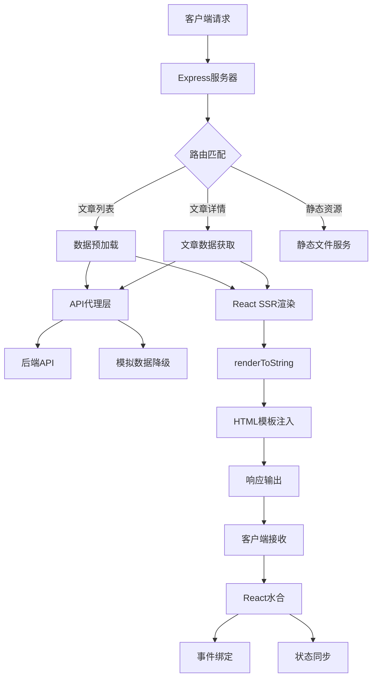

# SSR架构深度解析

## 概述

本文档深入分析我们项目中SSR（服务端渲染）的架构设计、实现原理和技术细节，帮助开发者理解整个SSR系统的工作机制。

## 整体架构图



## 核心组件详解

### 1. Express服务器层 (`server/index.ts`)

#### 职责
- HTTP请求处理和路由分发
- 静态资源服务
- API代理和数据预加载
- HTML模板渲染和响应输出

#### 关键实现

```typescript
// 路由处理和数据预加载
app.get('*', async (req, res) => {
  const url = req.originalUrl;
  let initialData: any = {};
  
  // 根据路由预加载数据
  if (url === '/') {
    const articlesData = await fetchArticlesFromAPI('latest', 1, 10);
    initialData = {
      articles: articlesData.items,
      currentCategory: 'latest',
      pagination: articlesData.pagination,
    };
  }
  
  // SSR渲染
  const { render } = await import('./entry-server.js');
  const renderResult = await render({ url, initialData });
  
  // HTML输出
  const html = renderHTML({
    html: renderResult.html,
    initialData: renderResult.initialData,
    title: generateTitle(url),
    description: generateDescription(url),
  });
  
  res.send(html);
});
```

#### 性能优化策略

```typescript
// 缓存策略
const cache = new Map();
const CACHE_TTL = 5 * 60 * 1000; // 5分钟

function getCachedData(key: string) {
  const cached = cache.get(key);
  if (cached && Date.now() - cached.timestamp < CACHE_TTL) {
    return cached.data;
  }
  return null;
}

// 压缩和安全头
app.use(compression());
app.use(helmet({
  contentSecurityPolicy: {
    directives: {
      defaultSrc: ["'self'"],
      scriptSrc: ["'self'", "'unsafe-inline'"],
      styleSrc: ["'self'", "'unsafe-inline'"],
      imgSrc: ["'self'", "data:", "https:"],
    },
  },
}));
```

### 2. API代理层 (`server/api.ts`)

#### 设计理念
- 统一数据获取接口
- 优雅降级机制
- 数据格式转换
- 错误处理和重试

#### 核心实现

```typescript
export async function fetchArticlesFromAPI(
  category?: ArticleCategory,
  page: number = 1,
  pageSize: number = 10
): Promise<PaginatedResponse<Article>> {
  try {
    // 构建请求参数
    const params: any = { page, limit: pageSize };
    if (category && category !== 'latest') {
      params.tag = getCategoryTag(category);
    }

    // API请求
    const response = await apiClient.get('/api/articles', { params });
    const backendArticles = response.data.data?.articles || [];
    
    // 数据转换
    const articles: Article[] = backendArticles.map(transformBackendArticle);
    
    return {
      items: articles,
      total: response.data.data?.total || 0,
      page,
      pageSize,
      hasMore: page * pageSize < (response.data.data?.total || 0),
    };
  } catch (error) {
    console.error('API请求失败，使用降级数据:', error);
    // 降级到模拟数据
    return generateMockData(category, page, pageSize);
  }
}
```

#### 数据转换层

```typescript
function transformBackendArticle(backendArticle: any): Article {
  return {
    id: backendArticle.id,
    title: backendArticle.title,
    summary: backendArticle.summary || generateSummary(backendArticle.content),
    content: backendArticle.content,
    category: inferCategoryFromTags(backendArticle.tags) || 'latest',
    author: backendArticle.author?.fullName || '未知作者',
    publishDate: backendArticle.publishedAt || backendArticle.createdAt,
    readTime: calculateReadTime(backendArticle.content),
    tags: backendArticle.tags?.map((tag: any) => tag.name || tag) || [],
    imageUrl: backendArticle.coverImage,
    isHot: Math.random() > 0.7,
  };
}
```

### 3. SSR渲染层 (`server/entry-server.tsx`)

#### 渲染流程

```typescript
export async function render(context: SSRContext) {
  const { url, initialData } = context;

  // 创建服务端store
  const store = new ArticleStore(initialData);

  // 服务端渲染
  const html = renderToString(
    <StaticRouter location={url}>
      <App />
    </StaticRouter>
  );

  return {
    html,
    initialData: store.getState(),
  };
}
```

#### 状态管理集成

```typescript
// 服务端状态管理
export class ArticleStore {
  private state: ServerStoreState;

  constructor(initialData?: Partial<ServerStoreState>) {
    this.state = {
      articles: [],
      currentCategory: 'latest',
      currentArticle: null,
      loading: false,
      error: null,
      pagination: {
        page: 1,
        pageSize: 10,
        total: 0,
        hasMore: true,
      },
      ...initialData,
    };
  }

  getState(): ServerStoreState {
    return { ...this.state };
  }
}
```

### 4. HTML模板系统 (`server/template.html`)

#### 模板结构

```html
<!DOCTYPE html>
<html lang="zh-CN">
<head>
    <!-- SEO优化 -->
    <title>{{title}}</title>
    <meta name="description" content="{{description}}">
    
    <!-- Open Graph -->
    <meta property="og:title" content="{{title}}">
    <meta property="og:description" content="{{description}}">
    <meta property="og:image" content="{{image}}">
    
    <!-- 移动端优化 -->
    <meta name="viewport" content="width=device-width, initial-scale=1.0">
    <meta name="apple-mobile-web-app-capable" content="yes">
    
    <!-- 资源预加载 -->
    <link rel="preload" href="/assets/main.css" as="style">
    <link rel="preload" href="/assets/main.js" as="script">
    
    <!-- 关键CSS -->
    <style>
        /* 首屏关键样式 */
        body { margin: 0; font-family: -apple-system, BlinkMacSystemFont, sans-serif; }
        .loading-skeleton { /* 骨架屏样式 */ }
    </style>
</head>
<body>
    <div id="root">{{html}}</div>
    
    <!-- 初始数据注入 -->
    <script>
        window.__INITIAL_DATA__ = {{initialData}};
        window.__SSR_CONTEXT__ = {{ssrContext}};
    </script>
    
    <!-- 应用脚本 -->
    {{scripts}}
</body>
</html>
```

#### 动态内容注入

```typescript
function renderHTML(options: RenderOptions) {
  const {
    html,
    title,
    description,
    url,
    image = '/default-og-image.jpg',
    initialData,
    styles = '',
    scripts = isDev ? 
      '<script type="module" src="/src/main.tsx"></script>' : 
      '<script type="module" src="/assets/main.js"></script>',
  } = options;

  return template
    .replace('{{html}}', html)
    .replace(/{{title}}/g, title)
    .replace(/{{description}}/g, description)
    .replace(/{{url}}/g, url)
    .replace(/{{image}}/g, image)
    .replace('{{initialData}}', JSON.stringify(initialData))
    .replace('{{ssrContext}}', JSON.stringify({ url, timestamp: Date.now() }))
    .replace('{{styles}}', styles)
    .replace('{{scripts}}', scripts);
}
```

### 5. 客户端水合 (`src/main.tsx`)

#### 水合流程

```typescript
// 获取服务端数据
const initialData = (window as any).__INITIAL_DATA__;
const ssrContext = (window as any).__SSR_CONTEXT__;

// 状态同步
if (initialData) {
  const store = useArticleStore.getState();
  
  if (initialData.articles) {
    useArticleStore.setState({
      articles: initialData.articles,
      currentCategory: initialData.currentCategory || 'latest',
      pagination: initialData.pagination || store.pagination,
      loading: false,
      error: null,
    });
  }
}

// 水合判断
const container = document.getElementById('root')!;
const isSSR = container.innerHTML.trim() !== '';

if (isSSR) {
  // SSR水合
  hydrateRoot(container, <App />);
} else {
  // 客户端渲染
  const root = createRoot(container);
  root.render(<App />);
}
```

#### 状态同步机制

```typescript
// 客户端状态管理
export const useArticleStore = create<ArticleStore>((set, get) => ({
  // 初始状态
  articles: [],
  currentCategory: 'latest',
  loading: false,
  error: null,
  
  // 数据获取方法
  loadArticles: async (category, page = 1) => {
    set({ loading: true, error: null });
    
    try {
      // 优先使用API，降级到模拟数据
      const response = await fetchArticles(category, page);
      
      set({
        articles: page === 1 ? response.items : [...get().articles, ...response.items],
        pagination: {
          page: response.page,
          pageSize: response.pageSize,
          total: response.total,
          hasMore: response.hasMore,
        },
        loading: false,
      });
    } catch (error) {
      set({
        error: error instanceof Error ? error.message : '加载失败',
        loading: false,
      });
    }
  },
}));
```

## 性能优化策略

### 1. 服务端优化

#### 缓存策略
```typescript
// 多层缓存
const memoryCache = new Map();
const redisCache = redis.createClient();

async function getCachedData(key: string) {
  // L1: 内存缓存
  if (memoryCache.has(key)) {
    return memoryCache.get(key);
  }
  
  // L2: Redis缓存
  const cached = await redisCache.get(key);
  if (cached) {
    const data = JSON.parse(cached);
    memoryCache.set(key, data);
    return data;
  }
  
  return null;
}
```

#### 流式渲染
```typescript
// 流式HTML输出
app.get('*', async (req, res) => {
  res.writeHead(200, {
    'Content-Type': 'text/html; charset=utf-8',
    'Transfer-Encoding': 'chunked',
  });
  
  // 发送HTML头部
  res.write(htmlHead);
  
  // 渲染并流式输出内容
  const stream = renderToNodeStream(<App />);
  stream.pipe(res, { end: false });
  
  stream.on('end', () => {
    // 发送脚本和结束标签
    res.write(htmlFooter);
    res.end();
  });
});
```

### 2. 客户端优化

#### 代码分割
```typescript
// 路由级别的代码分割
const HomePage = lazy(() => import('./pages/HomePage'));
const CategoryPage = lazy(() => import('./pages/CategoryPage'));
const ArticleDetail = lazy(() => import('./components/Article/ArticleDetail'));

// 组件级别的懒加载
const HeavyComponent = lazy(() => 
  import('./components/HeavyComponent').then(module => ({
    default: module.HeavyComponent
  }))
);
```

#### 资源预加载
```typescript
// 关键资源预加载
const preloadResources = [
  { href: '/assets/main.css', as: 'style' },
  { href: '/assets/main.js', as: 'script' },
  { href: '/api/articles?category=latest', as: 'fetch' },
];

preloadResources.forEach(resource => {
  const link = document.createElement('link');
  link.rel = 'preload';
  link.href = resource.href;
  link.as = resource.as;
  document.head.appendChild(link);
});
```

## 错误处理和监控

### 1. 错误边界

```typescript
class SSRErrorBoundary extends Component {
  constructor(props) {
    super(props);
    this.state = { hasError: false, error: null };
  }

  static getDerivedStateFromError(error) {
    return { hasError: true, error };
  }

  componentDidCatch(error, errorInfo) {
    // 错误上报
    console.error('SSR Error:', error, errorInfo);
    
    // 发送到监控服务
    if (typeof window !== 'undefined') {
      fetch('/api/errors', {
        method: 'POST',
        headers: { 'Content-Type': 'application/json' },
        body: JSON.stringify({ error: error.message, stack: error.stack }),
      });
    }
  }

  render() {
    if (this.state.hasError) {
      return <ErrorFallback error={this.state.error} />;
    }

    return this.props.children;
  }
}
```

### 2. 性能监控

```typescript
// 性能指标收集
function collectPerformanceMetrics() {
  if (typeof window !== 'undefined' && window.performance) {
    const timing = window.performance.timing;
    const metrics = {
      // 首屏时间
      firstPaint: timing.loadEventEnd - timing.navigationStart,
      // DOM解析时间
      domParsing: timing.domContentLoadedEventEnd - timing.domLoading,
      // 资源加载时间
      resourceLoading: timing.loadEventEnd - timing.domContentLoadedEventEnd,
      // SSR水合时间
      hydrationTime: performance.now() - window.__SSR_START_TIME__,
    };
    
    // 发送指标
    fetch('/api/metrics', {
      method: 'POST',
      headers: { 'Content-Type': 'application/json' },
      body: JSON.stringify(metrics),
    });
  }
}
```

## 开发和调试

### 1. 开发环境配置

```typescript
// 开发环境热更新
if (isDev) {
  const chokidar = require('chokidar');
  
  // 监听服务端文件变化
  chokidar.watch('./server/**/*').on('change', () => {
    delete require.cache[require.resolve('./server/entry-server')];
    console.log('Server-side code updated');
  });
  
  // 代理到Vite开发服务器
  app.use('/src', proxy('http://localhost:3002'));
}
```

### 2. 调试工具

```typescript
// SSR调试信息
if (process.env.NODE_ENV === 'development') {
  app.use('/debug', (req, res) => {
    res.json({
      memory: process.memoryUsage(),
      uptime: process.uptime(),
      cache: {
        size: cache.size,
        keys: Array.from(cache.keys()),
      },
      performance: {
        renderTime: lastRenderTime,
        apiCalls: apiCallCount,
      },
    });
  });
}
```

## 总结

我们的SSR架构通过以下关键设计实现了高性能和良好的开发体验：

1. **分层架构**：清晰的职责分离，便于维护和扩展
2. **数据预加载**：服务端预获取数据，减少客户端请求
3. **优雅降级**：API失败时自动使用模拟数据
4. **性能优化**：多层缓存、代码分割、资源预加载
5. **错误处理**：完善的错误边界和监控机制
6. **开发友好**：热更新、调试工具、详细日志

这种架构在保持灵活性的同时，提供了接近Next.js的开发体验和更好的性能控制能力。
