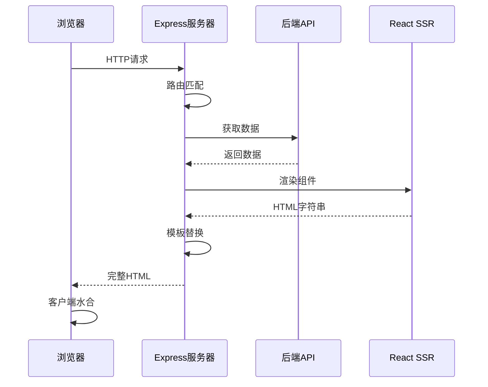

# SSR实现指南

## 概述

本项目采用自定义的SSR（服务端渲染）解决方案，基于Express + React DOM Server实现。本文档详细介绍了SSR的实现逻辑、架构设计和技术细节。

## 架构设计

### 整体架构

```
┌─────────────────┐    ┌─────────────────┐    ┌─────────────────┐
│   浏览器请求     │───▶│   Express服务器  │───▶│   后端API服务    │
└─────────────────┘    └─────────────────┘    └─────────────────┘
                              │
                              ▼
                       ┌─────────────────┐
                       │   React SSR     │
                       │   渲染引擎       │
                       └─────────────────┘
                              │
                              ▼
                       ┌─────────────────┐
                       │   HTML模板      │
                       │   + 初始数据     │
                       └─────────────────┘
```

### 核心组件

1. **Express服务器** (`server/index.ts`)
   - 处理HTTP请求
   - 路由匹配和数据预加载
   - HTML模板渲染
   - 静态资源服务

2. **SSR渲染引擎** (`server/entry-server.tsx`)
   - React组件服务端渲染
   - 状态管理初始化
   - 渲染结果输出

3. **API代理层** (`server/api.ts`)
   - 后端API调用
   - 数据格式转换
   - 错误处理和降级

4. **HTML模板** (`server/template.html`)
   - SEO优化标签
   - 初始数据注入
   - 资源预加载

## 实现流程

### 1. 请求处理流程



### 2. 数据预加载策略

根据不同路由预加载相应数据：

```typescript
// 路由数据预加载映射
const routeDataMap = {
  '/': () => fetchArticlesFromAPI('latest', 1, 10),
  '/frontend': () => fetchArticlesFromAPI('frontend', 1, 10),
  '/backend': () => fetchArticlesFromAPI('backend', 1, 10),
  '/article/:id': (id) => fetchArticleByIdFromAPI(id)
};
```

### 3. 服务端渲染过程

```typescript
// 1. 创建服务端store
const store = new ArticleStore(initialData);

// 2. 渲染React组件
const html = renderToString(
  <StaticRouter location={url}>
    <App />
  </StaticRouter>
);

// 3. 获取最终状态
const finalState = store.getState();

// 4. 返回渲染结果
return { html, initialData: finalState };
```

### 4. 客户端水合过程

```typescript
// 1. 获取服务端数据
const initialData = window.__INITIAL_DATA__;

// 2. 初始化客户端store
if (initialData) {
  useArticleStore.setState(initialData);
}

// 3. 水合DOM
const isSSR = container.innerHTML.trim() !== '';
if (isSSR) {
  hydrateRoot(container, <App />);
} else {
  createRoot(container).render(<App />);
}
```

## 核心特性

### 1. 数据预加载

- **服务端预加载**: 根据路由预先获取数据
- **状态同步**: 服务端状态传递给客户端
- **降级处理**: API失败时使用模拟数据

### 2. 性能优化

- **流式渲染**: 支持流式HTML输出
- **缓存策略**: 静态资源和API响应缓存
- **代码分割**: 按路由和功能分割代码
- **资源预加载**: 关键资源预加载

### 3. SEO优化

- **动态Meta标签**: 根据内容生成SEO标签
- **结构化数据**: 支持JSON-LD结构化数据
- **Open Graph**: 社交媒体分享优化
- **语义化HTML**: 搜索引擎友好的HTML结构

### 4. 错误处理

- **优雅降级**: SSR失败时降级到CSR
- **错误边界**: React错误边界处理
- **API容错**: API失败时的备用方案
- **监控告警**: 错误监控和告警机制

## 文件结构详解

```
server/
├── index.ts              # Express服务器主文件
├── entry-server.tsx      # SSR渲染入口
├── api.ts               # API代理层
├── store-server.ts      # 服务端状态管理
└── template.html        # HTML模板

src/
├── App.tsx              # 应用根组件
├── main.tsx             # 客户端入口（支持水合）
├── components/          # React组件
├── pages/               # 页面组件
├── store/               # 客户端状态管理
└── types/               # TypeScript类型定义
```

## 开发和部署

### 开发模式

```bash
# 客户端开发（Vite开发服务器）
pnpm dev

# SSR开发（Express + nodemon）
pnpm dev:ssr
```

### 生产构建

```bash
# 构建客户端和服务端
pnpm build:ssr

# 启动生产服务器
pnpm preview:ssr
```

### 环境变量

```env
PORT=3000                    # 服务器端口
NODE_ENV=production          # 运行环境
API_BASE_URL=http://api.com  # 后端API地址
CACHE_TTL=300               # 缓存时间（秒）
```

## 监控和调试

### 性能监控

- **首屏渲染时间**: 监控TTFB和FCP
- **水合时间**: 监控客户端水合耗时
- **API响应时间**: 监控后端API性能
- **错误率**: 监控SSR和API错误率

### 调试工具

- **开发者工具**: React DevTools支持
- **网络面板**: 查看SSR请求和响应
- **性能面板**: 分析渲染性能
- **控制台日志**: 服务端和客户端日志

## 最佳实践

### 1. 组件设计

- **同构组件**: 确保组件在服务端和客户端行为一致
- **副作用处理**: 避免在render中执行副作用
- **条件渲染**: 正确处理服务端和客户端的差异

### 2. 状态管理

- **初始状态**: 合理设计初始状态结构
- **状态同步**: 确保服务端状态正确传递
- **状态更新**: 避免水合后的状态不一致

### 3. 性能优化

- **数据预加载**: 只预加载必要的数据
- **缓存策略**: 合理设置缓存时间
- **资源优化**: 压缩和优化静态资源

### 4. 错误处理

- **边界处理**: 设置合适的错误边界
- **降级策略**: 制定完善的降级方案
- **监控告警**: 建立完善的监控体系

## 扩展功能

### 1. 国际化支持

```typescript
// 服务端语言检测
const locale = detectLocale(req.headers['accept-language']);
const messages = await loadMessages(locale);

// 渲染时注入语言数据
const html = renderToString(
  <IntlProvider locale={locale} messages={messages}>
    <App />
  </IntlProvider>
);
```

### 2. 主题系统

```typescript
// 服务端主题检测
const theme = detectTheme(req.cookies.theme);

// 注入主题样式
const themeStyles = generateThemeStyles(theme);
const html = template.replace('{{styles}}', themeStyles);
```

### 3. A/B测试

```typescript
// 服务端实验分组
const experiment = assignExperiment(req.ip);

// 渲染不同版本
const Component = experiment.variant === 'A' ? ComponentA : ComponentB;
```

## 总结

本SSR实现方案具有以下优势：

1. **灵活性高**: 完全控制渲染流程
2. **性能优秀**: 针对性优化，性能表现良好
3. **可扩展性强**: 易于添加新功能和优化
4. **成本可控**: 基于成熟技术栈，维护成本低

适用于对性能要求高、需要深度定制的项目场景。
