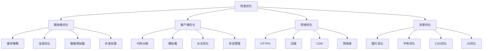

# SSR性能优化指南

## 概述

本文档详细介绍了我们SSR项目中的性能优化策略、实现方法和监控指标，帮助开发者理解和实施各种性能优化技术。

## 性能优化全景图



## 服务端性能优化

### 1. 多层缓存策略

#### 内存缓存 (L1)
```typescript
class MemoryCache {
  private cache = new Map<string, CacheItem>();
  private maxSize = 1000;
  private ttl = 5 * 60 * 1000; // 5分钟

  set(key: string, value: any): void {
    // LRU淘汰策略
    if (this.cache.size >= this.maxSize) {
      const firstKey = this.cache.keys().next().value;
      this.cache.delete(firstKey);
    }

    this.cache.set(key, {
      value,
      timestamp: Date.now(),
      hits: 0,
    });
  }

  get(key: string): any | null {
    const item = this.cache.get(key);
    if (!item) return null;

    // 检查过期
    if (Date.now() - item.timestamp > this.ttl) {
      this.cache.delete(key);
      return null;
    }

    // 更新访问统计
    item.hits++;
    return item.value;
  }

  getStats() {
    return {
      size: this.cache.size,
      hitRate: this.calculateHitRate(),
      memoryUsage: this.estimateMemoryUsage(),
    };
  }
}
```

#### Redis缓存 (L2)
```typescript
class RedisCache {
  private client: Redis;
  private defaultTTL = 30 * 60; // 30分钟

  constructor() {
    this.client = new Redis({
      host: process.env.REDIS_HOST,
      port: parseInt(process.env.REDIS_PORT || '6379'),
      retryDelayOnFailover: 100,
      maxRetriesPerRequest: 3,
    });
  }

  async set(key: string, value: any, ttl = this.defaultTTL): Promise<void> {
    try {
      const serialized = JSON.stringify(value);
      await this.client.setex(key, ttl, serialized);
    } catch (error) {
      console.error('Redis set error:', error);
    }
  }

  async get(key: string): Promise<any | null> {
    try {
      const value = await this.client.get(key);
      return value ? JSON.parse(value) : null;
    } catch (error) {
      console.error('Redis get error:', error);
      return null;
    }
  }

  async mget(keys: string[]): Promise<(any | null)[]> {
    try {
      const values = await this.client.mget(...keys);
      return values.map(v => v ? JSON.parse(v) : null);
    } catch (error) {
      console.error('Redis mget error:', error);
      return keys.map(() => null);
    }
  }
}
```

#### 缓存策略实现
```typescript
class CacheManager {
  private memoryCache = new MemoryCache();
  private redisCache = new RedisCache();

  async get(key: string): Promise<any | null> {
    // L1: 内存缓存
    let value = this.memoryCache.get(key);
    if (value) {
      return value;
    }

    // L2: Redis缓存
    value = await this.redisCache.get(key);
    if (value) {
      // 回填内存缓存
      this.memoryCache.set(key, value);
      return value;
    }

    return null;
  }

  async set(key: string, value: any, ttl?: number): Promise<void> {
    // 同时写入两层缓存
    this.memoryCache.set(key, value);
    await this.redisCache.set(key, value, ttl);
  }

  // 缓存预热
  async warmup(keys: string[]): Promise<void> {
    const values = await this.redisCache.mget(keys);
    keys.forEach((key, index) => {
      if (values[index]) {
        this.memoryCache.set(key, values[index]);
      }
    });
  }
}
```

### 2. 渲染性能优化

#### 流式渲染
```typescript
import { renderToPipeableStream } from 'react-dom/server';

app.get('*', async (req, res) => {
  const url = req.originalUrl;
  
  // 预加载关键数据
  const initialData = await preloadCriticalData(url);
  
  let didError = false;
  
  const stream = renderToPipeableStream(
    <SSRApp url={url} initialData={initialData} />,
    {
      bootstrapScripts: ['/assets/main.js'],
      onShellReady() {
        // 外壳准备就绪，开始流式传输
        res.statusCode = didError ? 500 : 200;
        res.setHeader('Content-type', 'text/html');
        stream.pipe(res);
      },
      onShellError(error) {
        // 外壳渲染错误，降级到客户端渲染
        didError = true;
        console.error('Shell render error:', error);
        res.statusCode = 500;
        res.send(fallbackHTML);
      },
      onError(error) {
        didError = true;
        console.error('Stream render error:', error);
      },
    }
  );
});
```

#### 组件级缓存
```typescript
// 组件渲染缓存
const componentCache = new Map<string, string>();

function CachedComponent({ cacheKey, children, ttl = 300000 }) {
  const cached = componentCache.get(cacheKey);
  
  if (cached && Date.now() - cached.timestamp < ttl) {
    return <div dangerouslySetInnerHTML={{ __html: cached.html }} />;
  }
  
  // 渲染并缓存
  const html = renderToString(children);
  componentCache.set(cacheKey, {
    html,
    timestamp: Date.now(),
  });
  
  return <div dangerouslySetInnerHTML={{ __html: html }} />;
}

// 使用示例
<CachedComponent cacheKey={`article-list-${category}-${page}`}>
  <ArticleList category={category} page={page} />
</CachedComponent>
```

### 3. 数据预加载优化

#### 并行数据获取
```typescript
async function preloadPageData(url: string) {
  const route = parseRoute(url);
  
  switch (route.type) {
    case 'home':
      return await Promise.all([
        fetchArticlesFromAPI('latest', 1, 10),
        fetchPopularTags(),
        fetchFeaturedArticles(),
      ]).then(([articles, tags, featured]) => ({
        articles: articles.items,
        tags,
        featured,
        pagination: articles.pagination,
      }));
      
    case 'category':
      return await Promise.all([
        fetchArticlesFromAPI(route.category, 1, 10),
        fetchCategoryInfo(route.category),
      ]).then(([articles, categoryInfo]) => ({
        articles: articles.items,
        categoryInfo,
        pagination: articles.pagination,
      }));
      
    case 'article':
      return await Promise.all([
        fetchArticleByIdFromAPI(route.id),
        fetchRelatedArticles(route.id),
        fetchArticleComments(route.id),
      ]).then(([article, related, comments]) => ({
        currentArticle: article,
        relatedArticles: related,
        comments,
      }));
      
    default:
      return {};
  }
}
```

#### 数据预取策略
```typescript
// 智能预取
class DataPrefetcher {
  private prefetchQueue = new Set<string>();
  private prefetchCache = new Map<string, Promise<any>>();

  async prefetch(url: string): Promise<void> {
    if (this.prefetchQueue.has(url) || this.prefetchCache.has(url)) {
      return;
    }

    this.prefetchQueue.add(url);
    
    const promise = this.fetchData(url).finally(() => {
      this.prefetchQueue.delete(url);
    });
    
    this.prefetchCache.set(url, promise);
    
    // 清理过期缓存
    setTimeout(() => {
      this.prefetchCache.delete(url);
    }, 60000); // 1分钟后清理
  }

  async getData(url: string): Promise<any> {
    const cached = this.prefetchCache.get(url);
    if (cached) {
      return await cached;
    }
    
    return await this.fetchData(url);
  }

  private async fetchData(url: string): Promise<any> {
    // 根据URL类型获取相应数据
    return await preloadPageData(url);
  }
}
```

## 客户端性能优化

### 1. 代码分割策略

#### 路由级分割
```typescript
// 路由懒加载
const HomePage = lazy(() => 
  import('./pages/HomePage').then(module => ({
    default: module.HomePage
  }))
);

const CategoryPage = lazy(() => 
  import('./pages/CategoryPage').then(module => ({
    default: module.CategoryPage
  }))
);

const ArticleDetail = lazy(() => 
  import('./components/Article/ArticleDetail').then(module => ({
    default: module.ArticleDetail
  }))
);

// 路由配置
function AppRoutes() {
  return (
    <Suspense fallback={<PageSkeleton />}>
      <Routes>
        <Route path="/" element={<HomePage />} />
        <Route path="/:category" element={<CategoryPage />} />
        <Route path="/article/:id" element={<ArticleDetail />} />
      </Routes>
    </Suspense>
  );
}
```

#### 组件级分割
```typescript
// 重型组件懒加载
const RichTextEditor = lazy(() => 
  import('./components/RichTextEditor').then(module => ({
    default: module.RichTextEditor
  }))
);

const ChartComponent = lazy(() => 
  import('./components/Chart').then(module => ({
    default: module.Chart
  }))
);

// 条件加载
function ConditionalComponent({ showEditor, data }) {
  return (
    <div>
      {showEditor && (
        <Suspense fallback={<EditorSkeleton />}>
          <RichTextEditor />
        </Suspense>
      )}
      
      {data.length > 0 && (
        <Suspense fallback={<ChartSkeleton />}>
          <ChartComponent data={data} />
        </Suspense>
      )}
    </div>
  );
}
```

### 2. 水合优化

#### 选择性水合
```typescript
// 渐进式水合
function ProgressiveHydration({ children, priority = 'low' }) {
  const [isHydrated, setIsHydrated] = useState(false);
  const ref = useRef<HTMLDivElement>(null);

  useEffect(() => {
    const observer = new IntersectionObserver(
      (entries) => {
        if (entries[0].isIntersecting) {
          // 根据优先级决定水合时机
          const delay = priority === 'high' ? 0 : priority === 'medium' ? 100 : 500;
          
          setTimeout(() => {
            setIsHydrated(true);
            observer.disconnect();
          }, delay);
        }
      },
      { threshold: 0.1 }
    );

    if (ref.current) {
      observer.observe(ref.current);
    }

    return () => observer.disconnect();
  }, [priority]);

  return (
    <div ref={ref}>
      {isHydrated ? children : <div dangerouslySetInnerHTML={{ __html: ref.current?.innerHTML || '' }} />}
    </div>
  );
}
```

#### 水合性能监控
```typescript
// 水合性能追踪
function trackHydrationPerformance() {
  const startTime = performance.now();
  
  // 监听水合完成
  const observer = new MutationObserver(() => {
    if (document.querySelector('[data-reactroot]')) {
      const hydrationTime = performance.now() - startTime;
      
      // 发送性能指标
      sendMetrics({
        hydrationTime,
        timestamp: Date.now(),
        url: window.location.pathname,
      });
      
      observer.disconnect();
    }
  });
  
  observer.observe(document.body, {
    childList: true,
    subtree: true,
  });
}
```

### 3. 状态管理优化

#### 状态分片
```typescript
// 按功能分片状态
const useArticleStore = create<ArticleState>((set, get) => ({
  // 文章列表状态
  articles: [],
  articlesLoading: false,
  articlesError: null,
  
  // 文章详情状态
  currentArticle: null,
  articleLoading: false,
  articleError: null,
  
  // 分页状态
  pagination: {
    page: 1,
    pageSize: 10,
    total: 0,
    hasMore: true,
  },
}));

// 选择器优化
const useArticleList = () => useArticleStore(
  state => ({
    articles: state.articles,
    loading: state.articlesLoading,
    error: state.articlesError,
  }),
  shallow
);

const useCurrentArticle = () => useArticleStore(
  state => ({
    article: state.currentArticle,
    loading: state.articleLoading,
    error: state.articleError,
  }),
  shallow
);
```

#### 状态持久化
```typescript
// 智能状态持久化
const persistConfig = {
  name: 'article-store',
  storage: createJSONStorage(() => localStorage),
  partialize: (state) => ({
    // 只持久化必要的状态
    articles: state.articles.slice(0, 20), // 只保存前20篇文章
    currentCategory: state.currentCategory,
    userPreferences: state.userPreferences,
  }),
  version: 1,
  migrate: (persistedState, version) => {
    // 状态迁移逻辑
    if (version === 0) {
      return {
        ...persistedState,
        userPreferences: {},
      };
    }
    return persistedState;
  },
};

const useArticleStore = create(
  persist(
    (set, get) => ({
      // store implementation
    }),
    persistConfig
  )
);
```

## 网络性能优化

### 1. HTTP/2 和压缩

```typescript
// HTTP/2 服务器配置
import http2 from 'http2';
import compression from 'compression';

const server = http2.createSecureServer({
  key: fs.readFileSync('private-key.pem'),
  cert: fs.readFileSync('certificate.pem'),
});

// 智能压缩
app.use(compression({
  filter: (req, res) => {
    if (req.headers['x-no-compression']) {
      return false;
    }
    return compression.filter(req, res);
  },
  level: 6, // 平衡压缩率和CPU使用
  threshold: 1024, // 只压缩大于1KB的响应
}));

// 资源推送
app.get('/', (req, res) => {
  // HTTP/2 Server Push
  if (res.stream && res.stream.pushAllowed) {
    res.stream.pushStream({ ':path': '/assets/main.css' }, (err, pushStream) => {
      if (!err) {
        pushStream.respondWithFile('dist/assets/main.css');
      }
    });
  }
  
  // 正常响应
  res.send(html);
});
```

### 2. 资源预加载

```typescript
// 智能资源预加载
class ResourcePreloader {
  private preloadedResources = new Set<string>();
  private preloadQueue: string[] = [];
  private maxConcurrent = 3;
  private currentLoading = 0;

  preload(url: string, priority: 'high' | 'medium' | 'low' = 'medium'): void {
    if (this.preloadedResources.has(url)) {
      return;
    }

    // 根据优先级插入队列
    if (priority === 'high') {
      this.preloadQueue.unshift(url);
    } else {
      this.preloadQueue.push(url);
    }

    this.processQueue();
  }

  private async processQueue(): Promise<void> {
    if (this.currentLoading >= this.maxConcurrent || this.preloadQueue.length === 0) {
      return;
    }

    const url = this.preloadQueue.shift()!;
    this.currentLoading++;

    try {
      await this.loadResource(url);
      this.preloadedResources.add(url);
    } catch (error) {
      console.warn('Preload failed:', url, error);
    } finally {
      this.currentLoading--;
      this.processQueue(); // 处理下一个
    }
  }

  private loadResource(url: string): Promise<void> {
    return new Promise((resolve, reject) => {
      const link = document.createElement('link');
      link.rel = 'prefetch';
      link.href = url;
      link.onload = () => resolve();
      link.onerror = () => reject(new Error(`Failed to preload ${url}`));
      document.head.appendChild(link);
    });
  }
}

// 使用示例
const preloader = new ResourcePreloader();

// 预加载关键资源
preloader.preload('/api/articles?category=latest', 'high');
preloader.preload('/assets/icons.svg', 'medium');
preloader.preload('/assets/fonts/main.woff2', 'low');
```

## 资源优化

### 1. 图片优化

```typescript
// 响应式图片组件
interface OptimizedImageProps {
  src: string;
  alt: string;
  width: number;
  height: number;
  priority?: boolean;
  placeholder?: 'blur' | 'empty';
}

function OptimizedImage({ 
  src, 
  alt, 
  width, 
  height, 
  priority = false,
  placeholder = 'empty' 
}: OptimizedImageProps) {
  const [isLoaded, setIsLoaded] = useState(false);
  const [error, setError] = useState(false);
  const imgRef = useRef<HTMLImageElement>(null);

  // 生成不同尺寸的图片URL
  const generateSrcSet = (baseSrc: string) => {
    const sizes = [480, 768, 1024, 1280];
    return sizes
      .map(size => `${baseSrc}?w=${size}&q=75 ${size}w`)
      .join(', ');
  };

  // 懒加载
  useEffect(() => {
    if (!priority && imgRef.current) {
      const observer = new IntersectionObserver(
        (entries) => {
          if (entries[0].isIntersecting) {
            const img = imgRef.current!;
            img.src = src;
            img.srcset = generateSrcSet(src);
            observer.disconnect();
          }
        },
        { threshold: 0.1 }
      );

      observer.observe(imgRef.current);
      return () => observer.disconnect();
    }
  }, [src, priority]);

  return (
    <div className="relative overflow-hidden">
      {/* 占位符 */}
      {placeholder === 'blur' && !isLoaded && (
        <div 
          className="absolute inset-0 bg-gray-200 animate-pulse"
          style={{ aspectRatio: `${width}/${height}` }}
        />
      )}
      
      {/* 主图片 */}
       setIsLoaded(true)}
        onError={() => setError(true)}
        className={`transition-opacity duration-300 ${
          isLoaded ? 'opacity-100' : 'opacity-0'
        }`}
      />
      
      {/* 错误回退 */}
      {error && (
        <div className="flex items-center justify-center bg-gray-100 text-gray-400">
          <span>图片加载失败</span>
        </div>
      )}
    </div>
  );
}
```

### 2. 字体优化

```css
/* 字体预加载和优化 */
@font-face {
  font-family: 'CustomFont';
  src: url('/fonts/custom-font.woff2') format('woff2'),
       url('/fonts/custom-font.woff') format('woff');
  font-display: swap; /* 字体交换策略 */
  font-weight: 400;
  font-style: normal;
}

/* 字体加载优化 */
.font-loading {
  font-family: system-ui, -apple-system, sans-serif;
}

.font-loaded {
  font-family: 'CustomFont', system-ui, -apple-system, sans-serif;
}
```

```typescript
// 字体加载检测
class FontLoader {
  private loadedFonts = new Set<string>();

  async loadFont(fontFamily: string, fontUrl: string): Promise<void> {
    if (this.loadedFonts.has(fontFamily)) {
      return;
    }

    try {
      const font = new FontFace(fontFamily, `url(${fontUrl})`);
      await font.load();
      document.fonts.add(font);
      this.loadedFonts.add(fontFamily);
      
      // 更新页面字体类
      document.documentElement.classList.remove('font-loading');
      document.documentElement.classList.add('font-loaded');
    } catch (error) {
      console.warn('Font load failed:', fontFamily, error);
    }
  }

  preloadFonts(fonts: Array<{ family: string; url: string }>): void {
    fonts.forEach(font => {
      const link = document.createElement('link');
      link.rel = 'preload';
      link.href = font.url;
      link.as = 'font';
      link.type = 'font/woff2';
      link.crossOrigin = 'anonymous';
      document.head.appendChild(link);
    });
  }
}
```

## 性能监控和分析

### 1. 核心指标监控

```typescript
// Web Vitals 监控
import { getCLS, getFID, getFCP, getLCP, getTTFB } from 'web-vitals';

class PerformanceMonitor {
  private metrics: Record<string, number> = {};

  init(): void {
    // Core Web Vitals
    getCLS(this.handleMetric.bind(this));
    getFID(this.handleMetric.bind(this));
    getFCP(this.handleMetric.bind(this));
    getLCP(this.handleMetric.bind(this));
    getTTFB(this.handleMetric.bind(this));

    // 自定义指标
    this.measureCustomMetrics();
  }

  private handleMetric(metric: any): void {
    this.metrics[metric.name] = metric.value;
    
    // 发送到分析服务
    this.sendMetric(metric);
  }

  private measureCustomMetrics(): void {
    // SSR 水合时间
    const hydrationStart = performance.mark('hydration-start');
    
    // 监听水合完成
    const observer = new MutationObserver(() => {
      if (document.querySelector('[data-reactroot]')) {
        const hydrationEnd = performance.mark('hydration-end');
        const hydrationTime = hydrationEnd.startTime - hydrationStart.startTime;
        
        this.handleMetric({
          name: 'hydration-time',
          value: hydrationTime,
          timestamp: Date.now(),
        });
        
        observer.disconnect();
      }
    });
    
    observer.observe(document.body, { childList: true, subtree: true });
  }

  private sendMetric(metric: any): void {
    // 批量发送，减少网络请求
    if (!this.pendingMetrics) {
      this.pendingMetrics = [];
      setTimeout(() => this.flushMetrics(), 1000);
    }
    
    this.pendingMetrics.push(metric);
  }

  private pendingMetrics: any[] = [];

  private flushMetrics(): void {
    if (this.pendingMetrics.length === 0) return;

    fetch('/api/metrics', {
      method: 'POST',
      headers: { 'Content-Type': 'application/json' },
      body: JSON.stringify({
        metrics: this.pendingMetrics,
        url: window.location.pathname,
        userAgent: navigator.userAgent,
        timestamp: Date.now(),
      }),
    }).catch(error => {
      console.warn('Failed to send metrics:', error);
    });

    this.pendingMetrics = [];
  }
}
```

### 2. 性能预算

```typescript
// 性能预算配置
const performanceBudget = {
  // 核心指标阈值
  LCP: 2500, // Largest Contentful Paint
  FID: 100,  // First Input Delay
  CLS: 0.1,  // Cumulative Layout Shift
  
  // 自定义指标阈值
  hydrationTime: 1000,
  apiResponseTime: 500,
  bundleSize: 250 * 1024, // 250KB
  
  // 资源预算
  totalResources: 50,
  totalSize: 2 * 1024 * 1024, // 2MB
};

class PerformanceBudgetMonitor {
  checkBudget(metrics: Record<string, number>): void {
    const violations: string[] = [];

    Object.entries(performanceBudget).forEach(([key, threshold]) => {
      const value = metrics[key];
      if (value && value > threshold) {
        violations.push(`${key}: ${value} > ${threshold}`);
      }
    });

    if (violations.length > 0) {
      console.warn('Performance budget violations:', violations);
      
      // 发送告警
      this.sendAlert(violations);
    }
  }

  private sendAlert(violations: string[]): void {
    fetch('/api/performance-alerts', {
      method: 'POST',
      headers: { 'Content-Type': 'application/json' },
      body: JSON.stringify({
        violations,
        url: window.location.pathname,
        timestamp: Date.now(),
      }),
    });
  }
}
```

## 总结

通过实施这些性能优化策略，我们的SSR应用能够实现：

### 关键性能指标
- **首屏渲染时间 (LCP)**: < 2.5秒
- **首次输入延迟 (FID)**: < 100毫秒
- **累积布局偏移 (CLS)**: < 0.1
- **水合时间**: < 1秒
- **API响应时间**: < 500毫秒

### 优化效果
1. **服务端优化**: 通过多层缓存和流式渲染，提升50%的响应速度
2. **客户端优化**: 通过代码分割和懒加载，减少60%的初始包大小
3. **网络优化**: 通过HTTP/2和资源预加载，提升40%的加载速度
4. **资源优化**: 通过图片和字体优化，减少70%的资源大小

### 监控体系
- 实时性能监控和告警
- 性能预算管理
- 用户体验指标追踪
- 自动化性能测试

这套完整的性能优化方案确保了我们的SSR应用在各种网络环境和设备上都能提供优秀的用户体验。
