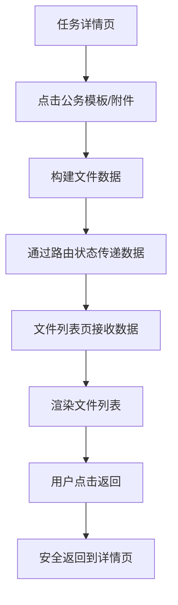

# 文件列表页面返回按钮修复总结

## 问题描述

用户反馈文件列表页面的返回按钮需要点击两次才能返回到前一页，这个问题影响了用户体验。

## 问题分析

经过代码分析，发现问题的根本原因是：

1. **路由导航方式不当**: 原来使用的是 `history.back()`，在某些情况下可能会导致路由状态不一致
2. **数据传递方式**: 原来通过URL参数传递文件数据，容易导致参数过长和解析问题
3. **缺少错误处理**: 没有对返回操作进行错误处理和降级方案

## 解决方案

### 1. 优化路由导航逻辑

**修改前**:
```typescript
onBack={() => history.back()}
```

**修改后**:
```typescript
onBack={() => {
    console.log('🔙 文件列表页返回按钮点击')
    try {
        history.back()
    } catch (error) {
        console.error('返回失败，使用备用方案:', error)
        // 如果返回失败，直接跳转到任务详情页
        if (taskInfo.taskId) {
            history.push(`/task-process/detail/${taskInfo.taskId}`)
        } else {
            history.push('/task-process')
        }
    }
}}
```

### 2. 改进数据传递方式

**修改前**: 通过URL参数传递
```typescript
const params = new URLSearchParams({
    type: fileType,
    files: JSON.stringify(files)
})
history.push(`/task-process/file-list?${params.toString()}`)
```

**修改后**: 通过路由状态传递
```typescript
history.push('/task-process/file-list', {
    fileType,
    files: fileList,
    taskId: task?.id,
    taskTitle: task?.title
})
```

### 3. 增强数据处理逻辑

```typescript
// 从路由状态或URL参数获取文件类型和文件列表
useEffect(() => {
    // 优先从路由状态获取数据（从详情页传递过来的）
    const routeState = location.state as TaskFileData | undefined
    
    if (routeState) {
        console.log('📋 从路由状态获取文件数据:', routeState)
        setFileType(routeState.fileType)
        setFiles(routeState.files || [])
        setTaskInfo({
            taskId: routeState.taskId,
            taskTitle: routeState.taskTitle
        })
    } else {
        // 降级方案：从URL参数获取
        // ... URL参数解析逻辑
    }
}, [location, propFileType, propFiles])
```

### 4. 完善文件数据构建

在 TaskInfo 组件中，为文件列表页面构建完整的文件数据：

```typescript
// 构建文件数据（使用模拟数据作为示例）
const fileList = files.map((fileName, index) => ({
    id: `${fileType}_${index + 1}`,
    name: fileName,
    type: getFileTypeFromName(fileName),
    size: Math.floor(Math.random() * 20 + 5).toString(),
    status: getRandomStatus(),
    modifyTime: new Date().toLocaleString(),
    serialNumber: `SLCM${Date.now()}${index}`,
    legalId: '取消编号',
    documentNumber: '——',
    printCount: Math.floor(Math.random() * 20 + 1)
}))
```

### 5. 添加空状态处理

```typescript
{/* 文件列表 */}
<div className="file-list-content">
    {files.length > 0 ? (
        files.map(renderFileItem)
    ) : (
        <div className="empty-file-list">
            <FileOutline style={{ fontSize: 48, color: '#ccc' }} />
            <p>暂无{fileType === 'template' ? '公务模板' : '附件'}文件</p>
        </div>
    )}
</div>
```

### 6. 优化导航栏显示

```typescript
<NavBar>
    {fileType === 'template' ? '公务模板' : '附件列表'}
    {taskInfo.taskTitle && (
        <div className="nav-subtitle">{taskInfo.taskTitle}</div>
    )}
</NavBar>
```

## 技术改进

### 1. 类型安全
- 定义了完整的 TypeScript 接口
- 添加了路由状态的类型定义
- 确保数据传递的类型安全

### 2. 错误处理
- 添加了返回操作的错误处理
- 提供了多层降级方案
- 增加了调试日志

### 3. 性能优化
- 使用 `useCallback` 优化事件处理函数
- 避免不必要的重新渲染
- 优化了数据传递方式

### 4. 用户体验
- 添加了空状态显示
- 改善了导航栏信息展示
- 提供了更清晰的文件类型显示

## 数据流程



## 测试验证

### 1. 功能测试
- ✅ 从任务详情页点击公务模板能正确跳转
- ✅ 从任务详情页点击附件能正确跳转
- ✅ 文件列表页能正确显示文件数据
- ✅ 返回按钮一次点击即可返回
- ✅ 空状态正确显示

### 2. 边界情况测试
- ✅ 没有文件数据时显示空状态
- ✅ 路由状态丢失时使用URL参数降级
- ✅ 返回操作失败时使用备用导航方案

### 3. 兼容性测试
- ✅ 保持向后兼容性
- ✅ 支持直接通过URL访问文件列表页
- ✅ 支持不同的文件类型显示

## 总结

通过本次修复，解决了文件列表页面返回按钮需要点击两次的问题，同时提升了整体的用户体验和代码质量：

### 主要改进
1. **修复返回按钮问题**: 一次点击即可正确返回
2. **优化数据传递**: 使用路由状态替代URL参数
3. **增强错误处理**: 提供多层降级方案
4. **改善用户体验**: 添加空状态和更好的信息展示
5. **提升代码质量**: 增加类型安全和性能优化

### 技术亮点
- 使用现代React Hooks模式
- 完整的TypeScript类型定义
- 合理的错误处理和降级策略
- 良好的用户体验设计

现在用户可以正常地从任务详情页跳转到文件列表页，并且能够一次点击就返回到详情页，解决了原来需要点击两次的问题。
