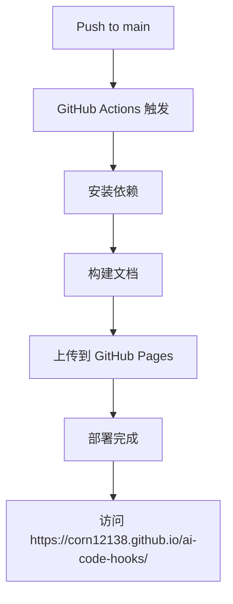

# Dumi 文档系统线上部署指南

本文档详细介绍如何将 Dumi 文档系统部署到线上并进行访问。

## 🌐 访问地址

### 主要访问地址
- **🏠 官方文档站点**: https://corn12138.github.io/ai-code-hooks/
- **📱 移动端访问**: 同上地址（响应式设计）
- **🌟 GitHub 仓库**: https://github.com/corn12138/ai-code-hooks

### 本地开发访问
```bash
# 在项目根目录启动开发服务器
cd shared/hooks
npm run dev

# 访问地址
http://localhost:8000
```

## 🚀 部署方式详解

### 1. GitHub Pages 自动部署

我们已经配置了完整的 GitHub Actions 工作流，支持自动部署：

**触发条件**：
- ✅ 推送到 `main` 分支
- ✅ 修改以下文件时：
  - `src/**` - 源代码
  - `docs/**` - 文档文件
  - `.dumirc.ts` - Dumi 配置
  - `package.json` - 包配置

**部署流程**：


### 2. 手动部署

如果需要手动部署，可以按以下步骤操作：

```bash
# 1. 进入项目目录
cd shared/hooks

# 2. 安装依赖
npm install

# 3. 构建文档
npm run docs:build

# 4. 推送到 GitHub
git add .
git commit -m "docs: update documentation"
git push origin main

# 5. 在 GitHub Actions 中查看部署状态
```

### 3. 自定义域名（可选）

如果你有自己的域名，可以配置 CNAME：

```bash
# 在项目根目录创建 CNAME 文件
echo "your-domain.com" > shared/hooks/public/CNAME

# 在域名提供商处设置 CNAME 记录
# CNAME: your-domain.com -> corn12138.github.io
```

## 📂 文档目录结构

```
shared/hooks/
├── docs/                    # 文档文件
│   ├── guide.md            # 快速开始指南
│   ├── examples.md         # 交互示例
│   └── ...
├── src/                     # 源代码（包含 .md 文档）
│   ├── useAuth/
│   │   ├── index.tsx       # Hook 实现
│   │   └── index.md        # API 文档
│   ├── useAsync/
│   └── ...
├── docs-dist/              # 构建输出目录
├── .dumirc.ts              # Dumi 配置文件
└── package.json
```

## 🔧 配置详解

### 核心配置项

```typescript
// .dumirc.ts
export default defineConfig({
  // 生产环境路径配置
  base: '/ai-code-hooks/',
  publicPath: '/ai-code-hooks/',
  
  // 静态导出
  exportStatic: {},
  
  // 路由配置
  hash: true,
  
  // 文档目录
  resolve: {
    docDirs: ['docs', 'src'],
  },
  
  // 主题配置
  themeConfig: {
    name: 'AI-Code Hooks',
    nav: [
      { title: '🏠 首页', link: '/' },
      { title: '🚀 快速开始', link: '/guide' },
      { title: '📚 Hooks', link: '/hooks' },
    ],
    // ...其他配置
  }
});
```

### 重要配置说明

1. **`base` 和 `publicPath`**：
   - 用于 GitHub Pages 部署
   - 必须与仓库名称一致

2. **`exportStatic`**：
   - 生成静态 HTML 文件
   - 支持 SEO 优化

3. **`hash: true`**：
   - 启用 hash 路由
   - 避免 GitHub Pages 路由问题

## 🔍 SEO 优化

### 1. 元信息配置

```typescript
// .dumirc.ts
export default defineConfig({
  title: 'AI-Code Hooks',
  description: '🎣 强大的 React Hooks 库，助力现代 Web 开发',
  
  // 网站图标
  favicon: '/favicon.ico',
  
  // 站点地图
  sitemap: {
    hostname: 'https://corn12138.github.io',
  },
  
  // 分析工具
  analytics: {
    // Google Analytics (可选)
    ga: 'G-XXXXXXXXXX',
  },
});
```

### 2. 文档头部信息

```markdown
---
title: useAuth - 用户认证管理
description: 功能强大的用户认证 Hook，支持登录、注册、权限管理等完整功能
keywords: React, Hooks, 认证, 用户管理, TypeScript
---

# useAuth

用户认证管理的完整解决方案...
```

## 🚀 性能优化

### 1. 代码分割

```typescript
// .dumirc.ts
export default defineConfig({
  // 代码分割配置
  chunks: ['vendors', 'umi'],
  chainWebpack: (config) => {
    config.optimization.splitChunks({
      chunks: 'all',
      cacheGroups: {
        vendors: {
          name: 'vendors',
          test: /[\\/]node_modules[\\/]/,
          priority: 10,
        },
      },
    });
  },
});
```

### 2. 资源优化

```typescript
// .dumirc.ts
export default defineConfig({
  // 压缩配置
  terserOptions: {
    compress: {
      drop_console: true,
      drop_debugger: true,
    },
  },
  
  // 图片优化
  chainWebpack: (config) => {
    config.module
      .rule('images')
      .test(/\.(png|jpe?g|gif|svg)$/)
      .use('url-loader')
      .loader('url-loader')
      .options({
        limit: 10000,
        name: 'static/images/[name].[hash:8].[ext]',
      });
  },
});
```

## 📊 访问统计

### 1. 内置统计

通过 GitHub Pages 可以查看基础的访问统计：

```bash
# 查看仓库统计
https://github.com/corn12138/ai-code-hooks/pulse

# 查看流量统计
https://github.com/corn12138/ai-code-hooks/graphs/traffic
```

### 2. 第三方统计（可选）

```typescript
// .dumirc.ts
export default defineConfig({
  // Google Analytics
  analytics: {
    ga: 'G-XXXXXXXXXX',
  },
  
  // 百度统计
  scripts: [
    {
      content: `
        var _hmt = _hmt || [];
        (function() {
          var hm = document.createElement("script");
          hm.src = "https://hm.baidu.com/hm.js?YOUR_BAIDU_ID";
          var s = document.getElementsByTagName("script")[0]; 
          s.parentNode.insertBefore(hm, s);
        })();
      `,
    },
  ],
});
```

## 🛠️ 常见问题

### Q1: 文档更新后没有生效？

**原因**：浏览器缓存或 CDN 缓存

**解决方案**：
```bash
# 1. 强制刷新浏览器 (Ctrl+F5)
# 2. 清除浏览器缓存
# 3. 等待 GitHub Pages 缓存更新（通常 5-10 分钟）
```

### Q2: 本地开发时路由错误？

**原因**：开发环境和生产环境路径不一致

**解决方案**：
```typescript
// .dumirc.ts
export default defineConfig({
  base: process.env.NODE_ENV === 'production' ? '/ai-code-hooks/' : '/',
  publicPath: process.env.NODE_ENV === 'production' ? '/ai-code-hooks/' : '/',
});
```

### Q3: 移动端样式异常？

**原因**：响应式样式配置不完整

**解决方案**：
```typescript
// .dumirc.ts
export default defineConfig({
  themeConfig: {
    // 移动端配置
    mobileHeader: {
      // 自定义移动端头部
    },
  },
  
  // 自定义样式
  styles: [
    `
    @media (max-width: 768px) {
      .dumi-default-header {
        padding: 0 16px;
      }
    }
    `,
  ],
});
```

## 🔄 更新部署

### 日常更新流程

```bash
# 1. 修改文档内容
vim shared/hooks/docs/guide.md

# 2. 本地预览
npm run dev

# 3. 构建测试
npm run docs:build

# 4. 提交更改
git add .
git commit -m "docs: update guide"
git push origin main

# 5. 等待 GitHub Actions 自动部署
```

### 版本发布流程

```bash
# 1. 更新版本号
npm version patch

# 2. 更新文档
# 修改相关文档内容

# 3. 创建 Release
git tag v1.0.3
git push origin v1.0.3

# 4. GitHub Actions 会自动：
#    - 发布 NPM 包
#    - 部署文档站点
```

## 🌟 访问体验

### 桌面端访问

1. **首页**：展示包的基本信息和特性
2. **快速开始**：详细的安装和使用指南
3. **API 文档**：每个 Hook 的详细说明
4. **交互示例**：可运行的代码示例

### 移动端访问

- ✅ 响应式设计，完美适配手机屏幕
- ✅ 侧边栏自动收起，节省空间
- ✅ 触摸友好的交互设计
- ✅ 代码块支持左右滑动查看

### 功能特色

- 🔍 **全文搜索**：快速找到需要的内容
- 🎨 **语法高亮**：代码阅读体验更佳
- 📱 **PWA 支持**：可添加到主屏幕
- 🌙 **主题切换**：支持深色/浅色模式
- 🔗 **深度链接**：直接分享具体章节

---

现在你的 Dumi 文档系统已经完全配置好了！访问 **https://corn12138.github.io/ai-code-hooks/** 即可查看线上文档。 