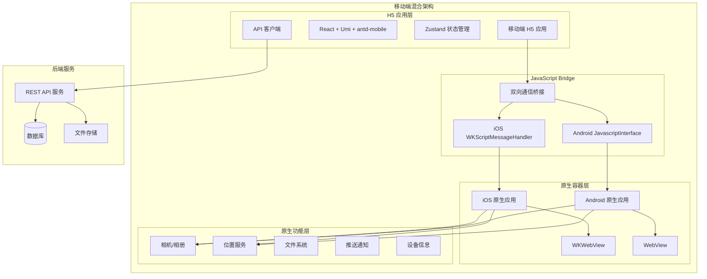
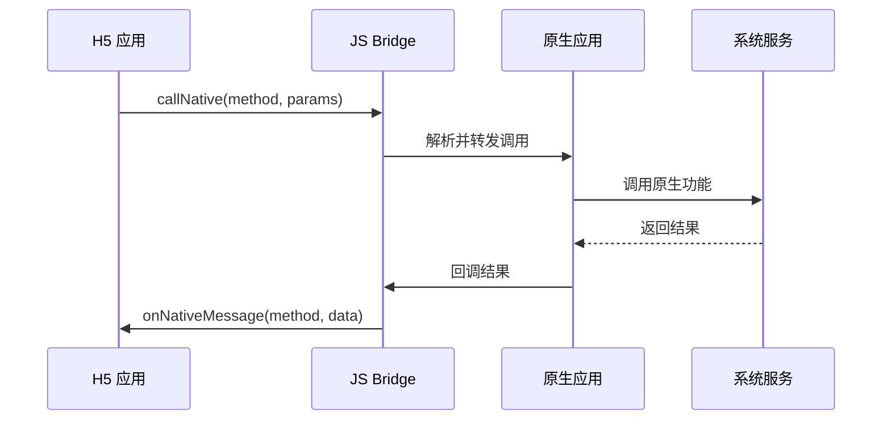
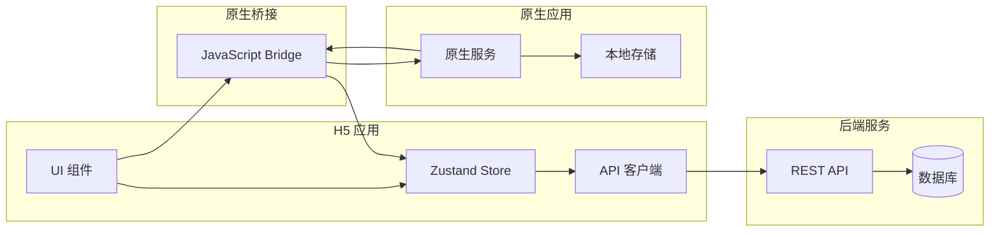

# 移动端混合架构文档

## 架构概述

本项目采用混合应用架构，通过原生容器（iOS/Android）嵌入 H5 应用的方式，实现了跨平台的移动工作台解决方案。这种架构结合了原生应用的性能优势和 H5 应用的开发效率。

## 整体架构图



## 技术栈对比

| 组件 | iOS 原生 | Android 原生 | H5 应用 |
|------|----------|--------------|---------|
| **编程语言** | Swift | Kotlin | TypeScript |
| **UI 框架** | SwiftUI | Jetpack Compose | React + antd-mobile |
| **WebView** | WKWebView | WebView | - |
| **桥接方案** | WKScriptMessageHandler | JavascriptInterface | JavaScript |
| **状态管理** | ObservableObject | StateFlow/LiveData | Zustand |
| **网络请求** | URLSession | Retrofit + OkHttp | Axios |
| **本地存储** | UserDefaults/Keychain | SharedPreferences/Room | LocalStorage/IndexedDB |
| **构建工具** | Xcode | Gradle | Umi + Vite |

## JavaScript Bridge 通信协议

### 通信流程



### 通信协议规范

#### H5 调用原生

```typescript
// H5 端调用原生方法
interface NativeBridgeRequest {
  method: string          // 方法名
  params: any            // 参数对象
  callbackId?: string    // 回调ID（可选）
}

// 示例：获取设备信息
nativeBridge.callNative('getDeviceInfo', {
  callbackId: 'device_info_001'
})
```

#### 原生回调 H5

```typescript
// 原生回调 H5 的数据格式
interface NativeBridgeResponse {
  method: string         // 回调方法名
  data: any             // 返回数据
  callbackId?: string   // 对应的回调ID
  error?: string        // 错误信息（可选）
}

// 示例：设备信息回调
{
  method: "callback",
  callbackId: "device_info_001",
  data: {
    platform: "iOS",
    version: "16.0",
    model: "iPhone 14"
  }
}
```

### 支持的桥接方法

| 方法名 | 参数 | 返回值 | 描述 |
|--------|------|--------|------|
| `getDeviceInfo` | `{}` | `DeviceInfo` | 获取设备信息 |
| `showToast` | `{message, duration?}` | `void` | 显示提示消息 |
| `openCamera` | `{quality?, type?}` | `{imageUrl}` | 打开相机拍照 |
| `openGallery` | `{multiple?, type?}` | `{imageUrls[]}` | 打开相册选择 |
| `getLocation` | `{accuracy?}` | `{lat, lng, address}` | 获取位置信息 |
| `saveToGallery` | `{imageUrl, fileName?}` | `{success}` | 保存图片到相册 |
| `shareContent` | `{text?, imageUrl?, url?}` | `{success}` | 分享内容 |
| `vibrate` | `{duration?}` | `void` | 震动反馈 |
| `setStatusBar` | `{color?, style?}` | `void` | 设置状态栏 |
| `openApp` | `{packageName, fallbackUrl?}` | `{success}` | 打开其他应用 |
| `getNetworkStatus` | `{}` | `{type, isConnected}` | 获取网络状态 |
| `getBatteryInfo` | `{}` | `{level, isCharging}` | 获取电池信息 |

## H5 应用架构

### 目录结构
```
src/
├── api/                 # API 接口层
├── components/          # 公共组件
├── pages/              # 页面组件
├── stores/             # 状态管理
├── utils/              # 工具函数
│   └── nativeBridge.ts # 原生桥接工具
├── hooks/              # 自定义 Hooks
└── config/             # 配置文件
```

### 原生桥接工具

```typescript
// utils/nativeBridge.ts
class NativeBridge {
  private callbacks = new Map<string, Function>()
  private callbackId = 0

  // 调用原生方法
  callNative(method: string, params: any = {}): Promise<any> {
    return new Promise((resolve, reject) => {
      const callbackId = `callback_${++this.callbackId}`
      
      this.callbacks.set(callbackId, (data: any, error?: string) => {
        if (error) {
          reject(new Error(error))
        } else {
          resolve(data)
        }
      })

      const message = {
        method,
        params: { ...params, callbackId }
      }

      if (this.isIOS()) {
        window.webkit?.messageHandlers?.nativeBridge?.postMessage(message)
      } else if (this.isAndroid()) {
        window.nativeBridge?.callNative(method, JSON.stringify(message.params))
      } else {
        // Web 环境模拟
        this.simulateNativeCall(method, params).then(resolve).catch(reject)
      }
    })
  }

  // 接收原生回调
  onNativeMessage(method: string, data: any) {
    if (method === 'callback' && data.callbackId) {
      const callback = this.callbacks.get(data.callbackId)
      if (callback) {
        callback(data.data, data.error)
        this.callbacks.delete(data.callbackId)
      }
    } else {
      // 处理其他原生主动调用
      this.handleNativeEvent(method, data)
    }
  }

  private isIOS(): boolean {
    return /iPad|iPhone|iPod/.test(navigator.userAgent)
  }

  private isAndroid(): boolean {
    return /Android/.test(navigator.userAgent)
  }
}

export default new NativeBridge()
```

### 设备信息 Hook

```typescript
// hooks/useDeviceInfo.ts
import { useEffect, useState } from 'react'
import nativeBridge from '@/utils/nativeBridge'

interface DeviceInfo {
  platform: 'iOS' | 'Android' | 'Web'
  isNative: boolean
  version: string
  model: string
  screenSize: { width: number; height: number }
}

export const useDeviceInfo = () => {
  const [deviceInfo, setDeviceInfo] = useState<DeviceInfo | null>(null)
  const [loading, setLoading] = useState(true)

  useEffect(() => {
    const getDeviceInfo = async () => {
      try {
        const info = await nativeBridge.callNative('getDeviceInfo')
        setDeviceInfo(info)
      } catch (error) {
        // 降级到 Web 环境
        setDeviceInfo({
          platform: 'Web',
          isNative: false,
          version: navigator.userAgent,
          model: 'Unknown',
          screenSize: {
            width: window.innerWidth,
            height: window.innerHeight
          }
        })
      } finally {
        setLoading(false)
      }
    }

    getDeviceInfo()
  }, [])

  return { deviceInfo, loading }
}
```

## 原生应用架构

### iOS 架构

```swift
// iOS 架构关键组件
struct ContentView: View {
    @StateObject private var webViewModel = WebViewModel()
    
    var body: some View {
        WebViewContainer(webViewModel: webViewModel)
            .onAppear {
                webViewModel.loadURL(AppConfig.shared.h5BaseURL)
            }
    }
}

// WebView 容器
struct WebViewContainer: UIViewRepresentable {
    @ObservedObject var webViewModel: WebViewModel
    
    func makeUIView(context: Context) -> WKWebView {
        let config = WKWebViewConfiguration()
        let bridge = WebBridgeService(webViewModel: webViewModel)
        
        config.userContentController.add(bridge, name: "nativeBridge")
        
        let webView = WKWebView(frame: .zero, configuration: config)
        webView.navigationDelegate = context.coordinator
        
        return webView
    }
}
```

### Android 架构

```kotlin
// Android 架构关键组件
@Composable
fun WebViewScreen(viewModel: WebViewViewModel) {
    AndroidView(
        factory = { context ->
            WebView(context).apply {
                settings.javaScriptEnabled = true
                addJavascriptInterface(
                    WebBridgeService(context, viewModel),
                    "nativeBridge"
                )
                webViewClient = CustomWebViewClient(viewModel)
            }
        },
        update = { webView ->
            if (viewModel.shouldLoadUrl) {
                webView.loadUrl(viewModel.currentUrl)
            }
        }
    )
}

// Bridge 服务
class WebBridgeService(
    private val context: Context,
    private val viewModel: WebViewViewModel
) {
    @JavascriptInterface
    fun callNative(method: String, params: String) {
        // 处理 H5 调用
    }
}
```

## 状态管理策略

### H5 应用状态管理

```typescript
// stores/app/useAppStore.ts
interface AppState {
  // 应用状态
  isNativeEnvironment: boolean
  deviceInfo: DeviceInfo | null
  networkStatus: NetworkStatus
  
  // 操作方法
  setDeviceInfo: (info: DeviceInfo) => void
  setNetworkStatus: (status: NetworkStatus) => void
}

export const useAppStore = create<AppState>((set) => ({
  isNativeEnvironment: false,
  deviceInfo: null,
  networkStatus: 'unknown',
  
  setDeviceInfo: (deviceInfo) => set({ 
    deviceInfo,
    isNativeEnvironment: deviceInfo.isNative 
  }),
  setNetworkStatus: (networkStatus) => set({ networkStatus })
}))
```

### 原生应用状态管理

#### iOS (SwiftUI)
```swift
class AppViewModel: ObservableObject {
    @Published var webViewState = WebViewState()
    @Published var deviceInfo = DeviceInfo()
    @Published var networkStatus: NetworkStatus = .unknown
    
    func updateWebViewState(_ state: WebViewState) {
        self.webViewState = state
    }
}
```

#### Android (Compose)
```kotlin
@HiltViewModel
class AppViewModel @Inject constructor() : ViewModel() {
    private val _webViewState = MutableStateFlow(WebViewState())
    val webViewState: StateFlow<WebViewState> = _webViewState.asStateFlow()
    
    private val _deviceInfo = MutableStateFlow<DeviceInfo?>(null)
    val deviceInfo: StateFlow<DeviceInfo?> = _deviceInfo.asStateFlow()
}
```

## 数据流管理

### 数据流向



### 缓存策略

| 数据类型 | H5 缓存 | 原生缓存 | 同步策略 |
|----------|---------|----------|----------|
| 用户信息 | LocalStorage | Keychain/SharedPrefs | 双向同步 |
| 应用配置 | SessionStorage | UserDefaults | 原生主导 |
| 文件数据 | IndexedDB | 文件系统 | 按需同步 |
| 临时数据 | Memory | Memory | 不同步 |

## 性能优化策略

### H5 应用优化

```typescript
// 代码分割
const LazyPage = lazy(() => import('./pages/SomePage'))

// 资源预加载
const preloadResources = () => {
  const link = document.createElement('link')
  link.rel = 'prefetch'
  link.href = '/api/user/profile'
  document.head.appendChild(link)
}

// WebView 优化
const optimizeForWebView = () => {
  // 禁用不必要的功能
  document.addEventListener('contextmenu', e => e.preventDefault())
  
  // 优化触摸事件
  document.addEventListener('touchstart', () => {}, { passive: true })
}
```

### 原生应用优化

#### iOS 优化
```swift
// WebView 预热
private func preloadWebView() {
    let configuration = WKWebViewConfiguration()
    configuration.processPool = sharedProcessPool
    
    // 预加载常用资源
    webView.loadHTMLString("<html></html>", baseURL: nil)
}

// 内存管理
private func optimizeMemoryUsage() {
    webView.configuration.websiteDataStore.removeData(
        ofTypes: WKWebsiteDataStore.allWebsiteDataTypes(),
        modifiedSince: Date(timeIntervalSince1970: 0)
    ) { }
}
```

#### Android 优化
```kotlin
// WebView 优化
private fun optimizeWebView(webView: WebView) {
    webView.settings.apply {
        setLayerType(View.LAYER_TYPE_HARDWARE, null)
        cacheMode = WebSettings.LOAD_DEFAULT
        setRenderPriority(WebSettings.RenderPriority.HIGH)
    }
}

// 内存回收
override fun onTrimMemory(level: Int) {
    super.onTrimMemory(level)
    if (level >= ComponentCallbacks2.TRIM_MEMORY_MODERATE) {
        webView?.freeMemory()
    }
}
```

## 安全考虑

### 通信安全

```typescript
// 消息验证
class SecureBridge extends NativeBridge {
  private readonly SECRET_KEY = 'your-secret-key'
  
  protected validateMessage(message: any): boolean {
    // 验证消息来源和完整性
    const expectedHash = this.calculateHash(message.data)
    return message.hash === expectedHash
  }
  
  private calculateHash(data: any): string {
    // 计算消息哈希
    return btoa(JSON.stringify(data) + this.SECRET_KEY)
  }
}
```

### 数据保护

```swift
// iOS 敏感数据保护
class SecureStorage {
    private let keychain = Keychain(service: "com.workbench.app")
    
    func saveSecureData(_ data: String, forKey key: String) {
        keychain[key] = data
    }
    
    func getSecureData(forKey key: String) -> String? {
        return keychain[key]
    }
}
```

```kotlin
// Android 数据加密
class EncryptedPreferences(context: Context) {
    private val sharedPreferences = EncryptedSharedPreferences.create(
        "secure_prefs",
        MasterKeys.getOrCreate(MasterKeys.AES256_GCM_SPEC),
        context,
        EncryptedSharedPreferences.PrefKeyEncryptionScheme.AES256_SIV,
        EncryptedSharedPreferences.PrefValueEncryptionScheme.AES256_GCM
    )
}
```

## 调试与测试

### 调试工具

```typescript
// H5 调试工具
class DebugBridge extends NativeBridge {
  constructor() {
    super()
    if (process.env.NODE_ENV === 'development') {
      this.enableDebugMode()
    }
  }
  
  private enableDebugMode() {
    // 启用 vConsole
    import('vconsole').then(VConsole => {
      new VConsole.default()
    })
    
    // 监听所有桥接调用
    this.onAnyCall = (method, params) => {
      console.log(`[Bridge] ${method}:`, params)
    }
  }
}
```

### 自动化测试

```typescript
// E2E 测试示例
describe('Hybrid App Bridge', () => {
  it('should get device info', async () => {
    const deviceInfo = await nativeBridge.callNative('getDeviceInfo')
    
    expect(deviceInfo).toHaveProperty('platform')
    expect(deviceInfo).toHaveProperty('version')
    expect(deviceInfo).toHaveProperty('model')
  })
  
  it('should handle camera access', async () => {
    const result = await nativeBridge.callNative('openCamera', {
      quality: 0.8
    })
    
    expect(result).toHaveProperty('imageUrl')
  })
})
```

## 部署策略

### 版本控制

```json
{
  "h5Version": "1.2.0",
  "iosVersion": "1.1.0", 
  "androidVersion": "1.1.0",
  "compatibility": {
    "minH5Version": "1.0.0",
    "minNativeVersion": "1.0.0"
  }
}
```

### 热更新机制

```typescript
// H5 热更新检查
class UpdateManager {
  async checkForUpdates(): Promise<UpdateInfo> {
    const response = await fetch('/api/version/check')
    const updateInfo = await response.json()
    
    if (this.shouldUpdate(updateInfo)) {
      return updateInfo
    }
    
    return null
  }
  
  private shouldUpdate(updateInfo: UpdateInfo): boolean {
    return semver.gt(updateInfo.version, this.getCurrentVersion())
  }
}
```

## 最佳实践

### 开发规范

1. **接口设计**
   - 保持接口向后兼容
   - 使用语义化版本控制
   - 提供详细的错误信息

2. **性能优化**
   - 减少桥接调用频率
   - 批量处理数据传输
   - 合理使用缓存机制

3. **错误处理**
   - 统一错误码规范
   - 提供降级方案
   - 记录详细日志

4. **安全防护**
   - 验证桥接调用来源
   - 敏感数据加密存储
   - 防范 XSS 攻击

### 监控与分析

```typescript
// 性能监控
class PerformanceMonitor {
  trackBridgeCall(method: string, duration: number) {
    analytics.track('bridge_call', {
      method,
      duration,
      platform: this.getPlatform()
    })
  }
  
  trackError(error: Error, context: any) {
    crashlytics.recordError(error, context)
  }
}
```

这种混合架构为移动应用开发提供了灵活性和效率，既保持了原生应用的性能和用户体验，又获得了 H5 开发的便利性和跨平台能力。
