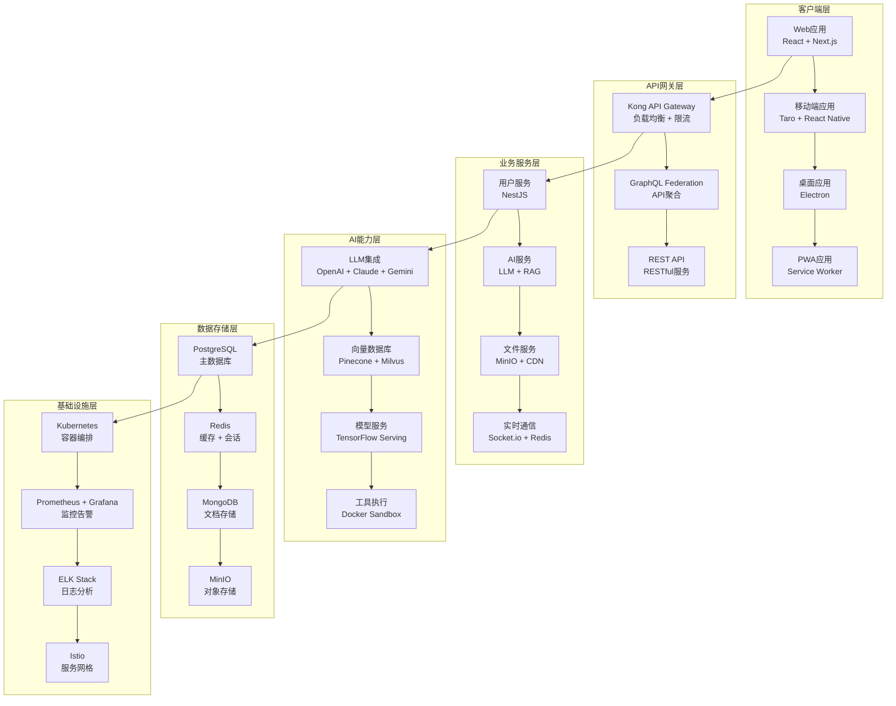

# AI-Code 平台系统架构设计

## 🏗️ 整体架构概览

### 1. 系统架构图



### 2. 技术栈选择

#### 前端技术栈
```typescript
// 核心框架
React 18.2.0           // 并发特性，Suspense
Next.js 14.0.0         // App Router，RSC
TypeScript 5.2.0       // 类型安全

// 状态管理
Zustand 4.4.0          // 轻量状态管理
React Query 5.0.0      // 服务端状态

// UI框架
Tailwind CSS 3.3.0    // 原子化CSS
Framer Motion 10.0.0   // 动画库
Headless UI 1.7.0      // 无样式组件

// 构建工具
Vite 5.0.0             // 快速构建
SWC                    // Rust编译器
Turbopack              // 下一代打包器
```

#### 后端技术栈
```typescript
// 核心框架
NestJS 10.0.0          // 企业级Node.js框架
Fastify 4.24.0         // 高性能HTTP服务器
GraphQL 16.8.0         // API查询语言

// 数据库
PostgreSQL 15.0        // 关系型数据库
Redis 7.2.0            // 内存数据库
MongoDB 7.0.0          // 文档数据库
Prisma 5.6.0           // ORM框架

// 消息队列
RabbitMQ 3.12.0        // 消息中间件
Bull Queue 4.12.0      // 任务队列

// AI集成
LangChain 0.0.200      // AI应用框架
OpenAI SDK 4.20.0      // OpenAI API
TensorFlow.js 4.15.0   // 机器学习
```

## 🔧 核心模块设计

### 1. 用户认证与授权模块

```typescript
// 认证策略设计
@Injectable()
export class AuthStrategy {
  // JWT + Refresh Token双令牌机制
  async validateUser(payload: JwtPayload): Promise<User> {
    const user = await this.userService.findById(payload.sub);
    if (!user || !user.isActive) {
      throw new UnauthorizedException('User not found or inactive');
    }
    
    // 角色权限检查
    const permissions = await this.rbacService.getUserPermissions(user.id);
    return { ...user, permissions };
  }
  
  // OAuth2.0 社交登录
  async socialLogin(provider: string, profile: Profile): Promise<AuthResult> {
    let user = await this.userService.findBySocialId(provider, profile.id);
    
    if (!user) {
      user = await this.userService.createFromSocial(provider, profile);
    }
    
    return this.generateTokens(user);
  }
  
  // 多因素认证 (MFA)
  async enableMFA(userId: string): Promise<MFASetupResult> {
    const secret = speakeasy.generateSecret({
      name: 'AI-Code Platform',
      account: userId
    });
    
    await this.userService.updateMFASecret(userId, secret.base32);
    
    return {
      qrCode: await qrcode.toDataURL(secret.otpauth_url),
      backupCodes: this.generateBackupCodes()
    };
  }
}
```

### 2. AI服务集成模块

```typescript
// AI服务编排器
@Injectable()
export class AIOrchestrator {
  private providers: Map<string, AIProvider> = new Map();
  private loadBalancer: LoadBalancer;
  private circuitBreaker: CircuitBreaker;
  
  constructor() {
    this.initializeProviders();
    this.setupLoadBalancing();
    this.setupCircuitBreaker();
  }
  
  // 智能路由：根据负载、成本、延迟选择最优提供商
  async routeRequest(request: AIRequest): Promise<AIResponse> {
    const provider = await this.selectOptimalProvider(request);
    
    return this.circuitBreaker.execute(async () => {
      const startTime = Date.now();
      
      try {
        const response = await provider.process(request);
        
        // 记录成功指标
        this.metricsCollector.recordSuccess(provider.name, Date.now() - startTime);
        
        return response;
      } catch (error) {
        // 记录失败并触发降级
        this.metricsCollector.recordFailure(provider.name, error);
        throw error;
      }
    });
  }
  
  // 提供商选择算法
  private async selectOptimalProvider(request: AIRequest): Promise<AIProvider> {
    const candidates = this.getCompatibleProviders(request);
    
    // 多维度评分
    const scores = await Promise.all(
      candidates.map(async provider => ({
        provider,
        score: await this.calculateProviderScore(provider, request)
      }))
    );
    
    // 选择最高分的提供商
    return scores.sort((a, b) => b.score - a.score)[0].provider;
  }
  
  private async calculateProviderScore(
    provider: AIProvider, 
    request: AIRequest
  ): Promise<number> {
    const metrics = await this.metricsCollector.getProviderMetrics(provider.name);
    
    // 综合评分算法
    const latencyScore = Math.max(0, 100 - metrics.avgLatency / 10);
    const reliabilityScore = (1 - metrics.errorRate) * 100;
    const costScore = Math.max(0, 100 - provider.costPerToken * 1000);
    const loadScore = Math.max(0, 100 - provider.currentLoad);
    
    return (latencyScore * 0.3 + reliabilityScore * 0.4 + 
            costScore * 0.2 + loadScore * 0.1);
  }
}
```

### 3. 实时通信模块

```typescript
// WebSocket网关设计
@WebSocketGateway({
  cors: { origin: process.env.ALLOWED_ORIGINS?.split(',') },
  transports: ['websocket', 'polling'],
  adapter: RedisIoAdapter // Redis适配器用于集群
})
export class RealtimeGateway {
  private connectionManager: ConnectionManager;
  private messageQueue: MessageQueue;
  private presenceService: PresenceService;
  
  @SubscribeMessage('join-room')
  async handleJoinRoom(
    @ConnectedSocket() socket: AuthenticatedSocket,
    @MessageBody() data: JoinRoomDto
  ) {
    // 权限验证
    const canJoin = await this.roomService.canUserJoinRoom(
      socket.user.id, 
      data.roomId
    );
    
    if (!canJoin) {
      throw new WsException('Insufficient permissions');
    }
    
    // 加入房间
    await socket.join(data.roomId);
    
    // 更新在线状态
    await this.presenceService.setUserOnline(socket.user.id, data.roomId);
    
    // 广播用户加入事件
    socket.to(data.roomId).emit('user-joined', {
      userId: socket.user.id,
      username: socket.user.username,
      timestamp: Date.now()
    });
    
    // 发送房间状态
    const roomState = await this.roomService.getRoomState(data.roomId);
    socket.emit('room-state', roomState);
  }
  
  @SubscribeMessage('ai-chat')
  async handleAIChat(
    @ConnectedSocket() socket: AuthenticatedSocket,
    @MessageBody() data: AIChatDto
  ) {
    // 消息验证和限流
    await this.rateLimiter.checkLimit(socket.user.id, 'ai-chat');
    
    // 创建聊天会话
    const session = await this.chatService.createSession({
      userId: socket.user.id,
      model: data.model,
      context: data.context
    });
    
    // 流式响应
    const stream = await this.aiOrchestrator.streamChat({
      sessionId: session.id,
      message: data.message,
      model: data.model
    });
    
    // 逐步发送响应
    for await (const chunk of stream) {
      socket.emit('ai-response-chunk', {
        sessionId: session.id,
        chunk: chunk.content,
        done: chunk.done
      });
      
      // 背压控制
      if (socket.bufferedAmount > MAX_BUFFER_SIZE) {
        await this.waitForDrain(socket);
      }
    }
  }
  
  // 连接管理
  async handleConnection(socket: AuthenticatedSocket) {
    const user = await this.authService.validateSocketToken(
      socket.handshake.auth.token
    );
    
    if (!user) {
      socket.disconnect();
      return;
    }
    
    socket.user = user;
    
    // 注册连接
    this.connectionManager.addConnection(socket);
    
    // 恢复用户会话
    await this.sessionService.restoreUserSessions(socket);
    
    // 发送欢迎消息
    socket.emit('connected', {
      userId: user.id,
      serverTime: Date.now(),
      capabilities: this.getServerCapabilities()
    });
  }
}
```

### 4. 数据存储设计

```typescript
// 数据访问层设计
@Injectable()
export class DataAccessLayer {
  private readReplicas: PrismaClient[];
  private writeClient: PrismaClient;
  private cacheClient: Redis;
  
  // 读写分离
  async findById<T>(
    model: string, 
    id: string, 
    options?: FindOptions
  ): Promise<T | null> {
    // 优先从缓存读取
    const cacheKey = `${model}:${id}`;
    const cached = await this.cacheClient.get(cacheKey);
    
    if (cached) {
      return JSON.parse(cached);
    }
    
    // 从只读副本读取
    const replica = this.getRandomReadReplica();
    const result = await replica[model].findUnique({
      where: { id },
      ...options
    });
    
    // 写入缓存
    if (result) {
      await this.cacheClient.setex(
        cacheKey, 
        CACHE_TTL, 
        JSON.stringify(result)
      );
    }
    
    return result;
  }
  
  // 事务处理
  async transaction<T>(
    operations: (tx: PrismaTransaction) => Promise<T>
  ): Promise<T> {
    return this.writeClient.$transaction(async (tx) => {
      const result = await operations(tx);
      
      // 清理相关缓存
      await this.invalidateCache(operations);
      
      return result;
    });
  }
  
  // 分页查询优化
  async findManyWithCursor<T>(
    model: string,
    cursor?: string,
    limit: number = 20,
    where?: any
  ): Promise<PaginatedResult<T>> {
    const cacheKey = `${model}:list:${hashObject({ cursor, limit, where })}`;
    const cached = await this.cacheClient.get(cacheKey);
    
    if (cached) {
      return JSON.parse(cached);
    }
    
    const replica = this.getRandomReadReplica();
    const items = await replica[model].findMany({
      where,
      take: limit + 1,
      ...(cursor && { cursor: { id: cursor } }),
      orderBy: { createdAt: 'desc' }
    });
    
    const hasNextPage = items.length > limit;
    const data = hasNextPage ? items.slice(0, -1) : items;
    const nextCursor = hasNextPage ? data[data.length - 1].id : null;
    
    const result = {
      data,
      pageInfo: {
        hasNextPage,
        nextCursor,
        count: data.length
      }
    };
    
    await this.cacheClient.setex(cacheKey, 300, JSON.stringify(result));
    
    return result;
  }
}
```

### 5. 微服务通信

```typescript
// 事件驱动架构
@Injectable()
export class EventBus {
  private publishers: Map<string, EventPublisher> = new Map();
  private subscribers: Map<string, EventHandler[]> = new Map();
  
  // 发布事件
  async publish<T>(event: DomainEvent<T>): Promise<void> {
    const eventName = event.constructor.name;
    
    // 同步处理本地订阅者
    const localHandlers = this.subscribers.get(eventName) || [];
    await Promise.allSettled(
      localHandlers.map(handler => handler.handle(event))
    );
    
    // 异步发布到消息队列
    const publisher = this.publishers.get(eventName);
    if (publisher) {
      await publisher.publish(event);
    }
    
    // 记录事件
    await this.eventStore.append(event);
  }
  
  // 订阅事件
  subscribe<T>(
    eventType: new (...args: any[]) => DomainEvent<T>,
    handler: EventHandler<T>
  ): void {
    const eventName = eventType.name;
    
    if (!this.subscribers.has(eventName)) {
      this.subscribers.set(eventName, []);
    }
    
    this.subscribers.get(eventName)!.push(handler);
  }
  
  // Saga事务模式
  async executeSaga(saga: Saga): Promise<SagaResult> {
    const sagaId = generateId();
    let completedSteps: SagaStep[] = [];
    
    try {
      for (const step of saga.steps) {
        await this.executeStep(step);
        completedSteps.push(step);
      }
      
      return { success: true, sagaId };
    } catch (error) {
      // 补偿操作
      await this.compensate(completedSteps.reverse());
      
      return { 
        success: false, 
        sagaId, 
        error: error.message,
        compensated: true 
      };
    }
  }
}
```

## 📊 性能优化策略

### 1. 数据库优化

```sql
-- 索引优化策略
CREATE INDEX CONCURRENTLY idx_users_email_active 
ON users(email) WHERE is_active = true;

CREATE INDEX CONCURRENTLY idx_messages_room_created 
ON messages(room_id, created_at DESC);

-- 分区表设计
CREATE TABLE messages_y2024m01 PARTITION OF messages
FOR VALUES FROM ('2024-01-01') TO ('2024-02-01');

-- 读写分离配置
-- 主库：写操作
-- 只读副本：查询操作（5个副本，地理分布）
```

### 2. 缓存策略

```typescript
// 多级缓存架构
class CacheManager {
  private l1Cache: LRUCache<string, any>; // 内存缓存
  private l2Cache: Redis; // 分布式缓存
  private l3Cache: CDN; // 边缘缓存
  
  async get<T>(key: string): Promise<T | null> {
    // L1缓存
    let value = this.l1Cache.get(key);
    if (value) {
      this.metrics.recordCacheHit('l1', key);
      return value;
    }
    
    // L2缓存
    value = await this.l2Cache.get(key);
    if (value) {
      this.l1Cache.set(key, value);
      this.metrics.recordCacheHit('l2', key);
      return JSON.parse(value);
    }
    
    // L3缓存（适用于静态资源）
    if (this.isStaticResource(key)) {
      value = await this.l3Cache.get(key);
      if (value) {
        this.metrics.recordCacheHit('l3', key);
        return value;
      }
    }
    
    this.metrics.recordCacheMiss(key);
    return null;
  }
  
  async set(key: string, value: any, ttl?: number): Promise<void> {
    // 同时写入L1和L2缓存
    this.l1Cache.set(key, value);
    await this.l2Cache.setex(key, ttl || DEFAULT_TTL, JSON.stringify(value));
    
    // 静态资源推送到CDN
    if (this.isStaticResource(key)) {
      await this.l3Cache.set(key, value);
    }
  }
}
```

### 3. API优化

```typescript
// GraphQL查询优化
@Resolver(() => User)
export class UserResolver {
  @Query(() => [User])
  @UseGuards(AuthGuard)
  async users(
    @Args() args: UsersArgs,
    @Info() info: GraphQLResolveInfo
  ): Promise<User[]> {
    // 查询字段分析，只查询需要的字段
    const requestedFields = getRequestedFields(info);
    
    // DataLoader防止N+1查询
    const users = await this.userLoader.loadMany(args.ids);
    
    // 预加载关联数据
    if (requestedFields.includes('posts')) {
      await this.postLoader.primeMany(
        users.flatMap(user => user.postIds)
      );
    }
    
    return users;
  }
  
  // 批量数据加载器
  @ResolveField(() => [Post])
  async posts(@Parent() user: User): Promise<Post[]> {
    return this.postLoader.load(user.id);
  }
}

// API限流和防护
@Injectable()
export class RateLimitGuard implements CanActivate {
  async canActivate(context: ExecutionContext): Promise<boolean> {
    const request = context.switchToHttp().getRequest();
    const user = request.user;
    
    // 基于用户的限流
    const userLimit = await this.rateLimiter.checkUserLimit(user.id);
    if (!userLimit.allowed) {
      throw new TooManyRequestsException(
        `Rate limit exceeded. Try again in ${userLimit.resetTime}s`
      );
    }
    
    // 基于IP的限流
    const ipLimit = await this.rateLimiter.checkIPLimit(request.ip);
    if (!ipLimit.allowed) {
      throw new TooManyRequestsException('IP rate limit exceeded');
    }
    
    return true;
  }
}
```

## 🔒 安全架构设计

### 1. 认证安全

```typescript
// 安全认证策略
@Injectable()
export class SecurityService {
  // 密码安全策略
  async hashPassword(password: string): Promise<string> {
    const saltRounds = 12;
    return bcrypt.hash(password, saltRounds);
  }
  
  // JWT安全配置
  generateAccessToken(user: User): string {
    return this.jwtService.sign(
      { 
        sub: user.id, 
        email: user.email,
        roles: user.roles.map(r => r.name)
      },
      {
        expiresIn: '15m', // 短期访问令牌
        audience: 'api.ai-code.com',
        issuer: 'auth.ai-code.com'
      }
    );
  }
  
  generateRefreshToken(user: User): string {
    return this.jwtService.sign(
      { sub: user.id, type: 'refresh' },
      {
        expiresIn: '7d', // 长期刷新令牌
        secret: process.env.REFRESH_TOKEN_SECRET
      }
    );
  }
  
  // API密钥管理
  async generateAPIKey(userId: string, permissions: Permission[]): Promise<APIKey> {
    const key = this.cryptoService.generateSecureKey(32);
    const hashedKey = await this.cryptoService.hash(key);
    
    const apiKey = await this.apiKeyRepository.create({
      userId,
      keyHash: hashedKey,
      permissions,
      expiresAt: new Date(Date.now() + 365 * 24 * 60 * 60 * 1000), // 1年
      lastUsedAt: null
    });
    
    return { ...apiKey, key }; // 只返回一次原始key
  }
}
```

### 2. 数据安全

```typescript
// 数据加密服务
@Injectable()
export class EncryptionService {
  private readonly algorithm = 'aes-256-gcm';
  private readonly keyDerivation = 'pbkdf2';
  
  // 字段级加密
  async encryptSensitiveData(data: string, context: string): Promise<EncryptedData> {
    const key = await this.deriveKey(context);
    const iv = crypto.randomBytes(16);
    
    const cipher = crypto.createCipher(this.algorithm, key);
    cipher.setAAD(Buffer.from(context));
    
    let encrypted = cipher.update(data, 'utf8', 'hex');
    encrypted += cipher.final('hex');
    
    return {
      data: encrypted,
      iv: iv.toString('hex'),
      tag: cipher.getAuthTag().toString('hex'),
      algorithm: this.algorithm
    };
  }
  
  // 数据脱敏
  maskSensitiveData(data: any, maskingRules: MaskingRule[]): any {
    const masked = { ...data };
    
    for (const rule of maskingRules) {
      if (masked[rule.field]) {
        masked[rule.field] = this.applyMask(masked[rule.field], rule.type);
      }
    }
    
    return masked;
  }
  
  private applyMask(value: string, type: MaskType): string {
    switch (type) {
      case 'email':
        return value.replace(/(.{2}).*(@.*)/, '$1***$2');
      case 'phone':
        return value.replace(/(\d{3})\d{4}(\d{4})/, '$1****$2');
      case 'creditCard':
        return value.replace(/\d(?=\d{4})/g, '*');
      default:
        return '***';
    }
  }
}
```

### 3. 网络安全

```typescript
// 安全中间件配置
export const securityMiddleware = [
  // CORS配置
  cors({
    origin: (origin, callback) => {
      const allowedOrigins = process.env.ALLOWED_ORIGINS?.split(',') || [];
      if (!origin || allowedOrigins.includes(origin)) {
        callback(null, true);
      } else {
        callback(new Error('Not allowed by CORS'));
      }
    },
    credentials: true,
    optionsSuccessStatus: 200
  }),
  
  // CSP头
  helmet({
    contentSecurityPolicy: {
      directives: {
        defaultSrc: ["'self'"],
        scriptSrc: ["'self'", "'unsafe-inline'", 'https://cdn.jsdelivr.net'],
        styleSrc: ["'self'", "'unsafe-inline'", 'https://fonts.googleapis.com'],
        imgSrc: ["'self'", 'data:', 'https:'],
        connectSrc: ["'self'", 'wss:', 'https://api.openai.com'],
        fontSrc: ["'self'", 'https://fonts.gstatic.com'],
        objectSrc: ["'none'"],
        mediaSrc: ["'self'"],
        frameSrc: ["'none'"]
      }
    }
  }),
  
  // 请求大小限制
  express.json({ limit: '10mb' }),
  express.urlencoded({ extended: true, limit: '10mb' }),
  
  // 请求频率限制
  rateLimit({
    windowMs: 15 * 60 * 1000, // 15分钟
    max: 1000, // 每个IP最多1000个请求
    message: 'Too many requests from this IP',
    standardHeaders: true,
    legacyHeaders: false
  })
];
```

## 📈 监控与运维

### 1. 监控指标

```typescript
// 自定义指标收集
@Injectable()
export class MetricsCollector {
  private readonly promClient = require('prom-client');
  
  // 业务指标
  private readonly httpRequestDuration = new this.promClient.Histogram({
    name: 'http_request_duration_ms',
    help: 'Duration of HTTP requests in ms',
    labelNames: ['method', 'route', 'status_code'],
    buckets: [0.1, 5, 15, 50, 100, 500]
  });
  
  private readonly aiRequestCount = new this.promClient.Counter({
    name: 'ai_requests_total',
    help: 'Total number of AI requests',
    labelNames: ['provider', 'model', 'status']
  });
  
  private readonly activeConnections = new this.promClient.Gauge({
    name: 'websocket_connections_active',
    help: 'Number of active WebSocket connections',
    labelNames: ['room']
  });
  
  // 收集系统指标
  collectDefaultMetrics(): void {
    this.promClient.collectDefaultMetrics({
      prefix: 'ai_code_',
      gcDurationBuckets: [0.001, 0.01, 0.1, 1, 2, 5]
    });
  }
  
  // 记录HTTP请求
  recordHttpRequest(method: string, route: string, statusCode: number, duration: number): void {
    this.httpRequestDuration
      .labels(method, route, statusCode.toString())
      .observe(duration);
  }
  
  // 记录AI请求
  recordAIRequest(provider: string, model: string, status: 'success' | 'error'): void {
    this.aiRequestCount
      .labels(provider, model, status)
      .inc();
  }
}
```

### 2. 日志管理

```typescript
// 结构化日志配置
import { Logger } from '@nestjs/common';
import { WinstonModule } from 'nest-winston';
import * as winston from 'winston';

export const loggerConfig = WinstonModule.createLogger({
  transports: [
    // 控制台输出
    new winston.transports.Console({
      format: winston.format.combine(
        winston.format.timestamp(),
        winston.format.colorize(),
        winston.format.printf(({ timestamp, level, message, ...meta }) => {
          return `${timestamp} [${level}]: ${message} ${
            Object.keys(meta).length ? JSON.stringify(meta, null, 2) : ''
          }`;
        })
      )
    }),
    
    // 文件输出
    new winston.transports.File({
      filename: 'logs/error.log',
      level: 'error',
      format: winston.format.combine(
        winston.format.timestamp(),
        winston.format.json()
      )
    }),
    
    new winston.transports.File({
      filename: 'logs/combined.log',
      format: winston.format.combine(
        winston.format.timestamp(),
        winston.format.json()
      )
    }),
    
    // ELK Stack集成
    new winston.transports.Http({
      host: 'elasticsearch.ai-code.com',
      port: 9200,
      path: '/logs/_doc',
      format: winston.format.json()
    })
  ]
});

// 日志拦截器
@Injectable()
export class LoggingInterceptor implements NestInterceptor {
  private readonly logger = new Logger(LoggingInterceptor.name);
  
  intercept(context: ExecutionContext, next: CallHandler): Observable<any> {
    const request = context.switchToHttp().getRequest();
    const { method, url, body, user } = request;
    const startTime = Date.now();
    
    return next.handle().pipe(
      tap(data => {
        const duration = Date.now() - startTime;
        
        this.logger.log({
          message: 'HTTP Request Completed',
          method,
          url,
          userId: user?.id,
          duration,
          statusCode: context.switchToHttp().getResponse().statusCode,
          requestBody: this.sanitizeBody(body),
          responseSize: JSON.stringify(data).length
        });
      }),
      catchError(error => {
        const duration = Date.now() - startTime;
        
        this.logger.error({
          message: 'HTTP Request Failed',
          method,
          url,
          userId: user?.id,
          duration,
          error: error.message,
          stack: error.stack,
          requestBody: this.sanitizeBody(body)
        });
        
        throw error;
      })
    );
  }
  
  private sanitizeBody(body: any): any {
    if (!body) return body;
    
    const sanitized = { ...body };
    const sensitiveFields = ['password', 'token', 'apiKey', 'secret'];
    
    for (const field of sensitiveFields) {
      if (sanitized[field]) {
        sanitized[field] = '***';
      }
    }
    
    return sanitized;
  }
}
```

### 3. 健康检查

```typescript
// 健康检查服务
@Injectable()
export class HealthService {
  constructor(
    private readonly db: DatabaseHealthIndicator,
    private readonly redis: RedisHealthIndicator,
    private readonly ai: AIServiceHealthIndicator
  ) {}
  
  @Get('health')
  @HealthCheck()
  check() {
    return this.health.check([
      // 数据库健康检查
      () => this.db.pingCheck('database'),
      
      // Redis健康检查
      () => this.redis.pingCheck('redis'),
      
      // AI服务健康检查
      () => this.ai.isHealthy('openai'),
      () => this.ai.isHealthy('claude'),
      
      // 磁盘空间检查
      () => this.health.diskStorageCheck('storage', {
        path: '/',
        thresholdPercent: 0.9
      }),
      
      // 内存使用检查
      () => this.health.memoryHeapCheck('memory_heap', 150 * 1024 * 1024),
      
      // 自定义业务健康检查
      () => this.checkBusinessHealth()
    ]);
  }
  
  private async checkBusinessHealth(): Promise<HealthIndicatorResult> {
    try {
      // 检查关键业务指标
      const activeUsers = await this.userService.getActiveUserCount();
      const aiResponseTime = await this.aiService.checkResponseTime();
      const messageQueueSize = await this.queueService.getQueueSize();
      
      const isHealthy = 
        activeUsers < 10000 && // 活跃用户不超过限制
        aiResponseTime < 5000 && // AI响应时间正常
        messageQueueSize < 1000; // 消息队列不积压
      
      return {
        business: {
          status: isHealthy ? 'up' : 'down',
          details: {
            activeUsers,
            aiResponseTime,
            messageQueueSize
          }
        }
      };
    } catch (error) {
      return {
        business: {
          status: 'down',
          error: error.message
        }
      };
    }
  }
}
```

## 🚀 部署架构

### 1. Kubernetes部署配置

```yaml
# deployment.yaml
apiVersion: apps/v1
kind: Deployment
metadata:
  name: ai-code-api
spec:
  replicas: 3
  selector:
    matchLabels:
      app: ai-code-api
  template:
    metadata:
      labels:
        app: ai-code-api
    spec:
      containers:
      - name: api
        image: ai-code/api:latest
        ports:
        - containerPort: 3000
        env:
        - name: DATABASE_URL
          valueFrom:
            secretKeyRef:
              name: db-secret
              key: url
        - name: REDIS_URL
          valueFrom:
            configMapKeyRef:
              name: redis-config
              key: url
        resources:
          requests:
            memory: "512Mi"
            cpu: "250m"
          limits:
            memory: "1Gi"
            cpu: "500m"
        livenessProbe:
          httpGet:
            path: /health
            port: 3000
          initialDelaySeconds: 30
          periodSeconds: 10
        readinessProbe:
          httpGet:
            path: /health/ready
            port: 3000
          initialDelaySeconds: 5
          periodSeconds: 5

---
# service.yaml
apiVersion: v1
kind: Service
metadata:
  name: ai-code-api-service
spec:
  selector:
    app: ai-code-api
  ports:
  - protocol: TCP
    port: 80
    targetPort: 3000
  type: ClusterIP

---
# ingress.yaml
apiVersion: networking.k8s.io/v1
kind: Ingress
metadata:
  name: ai-code-ingress
  annotations:
    kubernetes.io/ingress.class: nginx
    cert-manager.io/cluster-issuer: letsencrypt-prod
    nginx.ingress.kubernetes.io/rate-limit: "100"
spec:
  tls:
  - hosts:
    - api.ai-code.com
    secretName: ai-code-tls
  rules:
  - host: api.ai-code.com
    http:
      paths:
      - path: /
        pathType: Prefix
        backend:
          service:
            name: ai-code-api-service
            port:
              number: 80
```

### 2. CI/CD流水线

```yaml
# .github/workflows/deploy.yml
name: Deploy to Production

on:
  push:
    branches: [main]

jobs:
  test:
    runs-on: ubuntu-latest
    steps:
    - uses: actions/checkout@v3
    
    - name: Setup Node.js
      uses: actions/setup-node@v3
      with:
        node-version: '18'
        cache: 'pnpm'
    
    - name: Install dependencies
      run: pnpm install
    
    - name: Run tests
      run: pnpm test:ci
    
    - name: Run E2E tests
      run: pnpm test:e2e
    
    - name: Code quality check
      run: pnpm lint && pnpm type-check

  build:
    needs: test
    runs-on: ubuntu-latest
    steps:
    - uses: actions/checkout@v3
    
    - name: Build Docker image
      run: |
        docker build -t ai-code/api:${{ github.sha }} .
        docker tag ai-code/api:${{ github.sha }} ai-code/api:latest
    
    - name: Push to registry
      run: |
        echo ${{ secrets.DOCKER_PASSWORD }} | docker login -u ${{ secrets.DOCKER_USERNAME }} --password-stdin
        docker push ai-code/api:${{ github.sha }}
        docker push ai-code/api:latest

  deploy:
    needs: build
    runs-on: ubuntu-latest
    environment: production
    steps:
    - name: Deploy to Kubernetes
      run: |
        kubectl set image deployment/ai-code-api api=ai-code/api:${{ github.sha }}
        kubectl rollout status deployment/ai-code-api
    
    - name: Run smoke tests
      run: |
        curl -f https://api.ai-code.com/health || exit 1
```

这个系统架构设计文档展示了企业级AI平台的完整技术方案，涵盖了从前端到后端、从开发到运维的各个方面，充分体现了高级前端开发工程师应具备的全栈架构设计能力。
